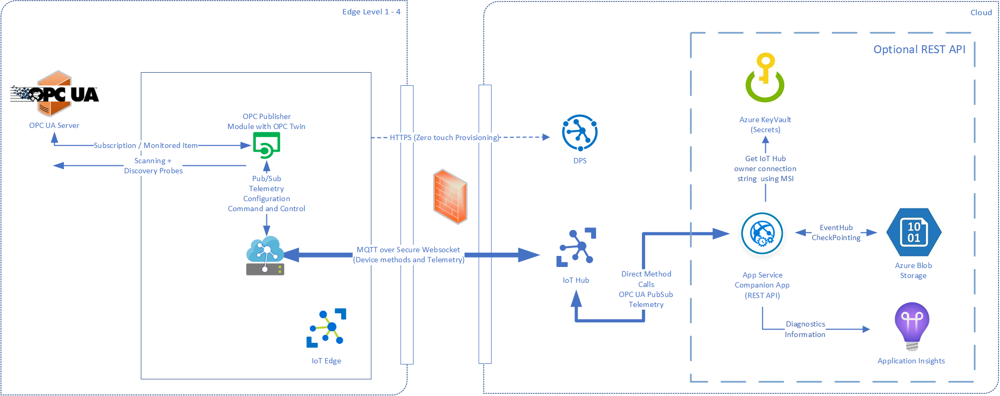
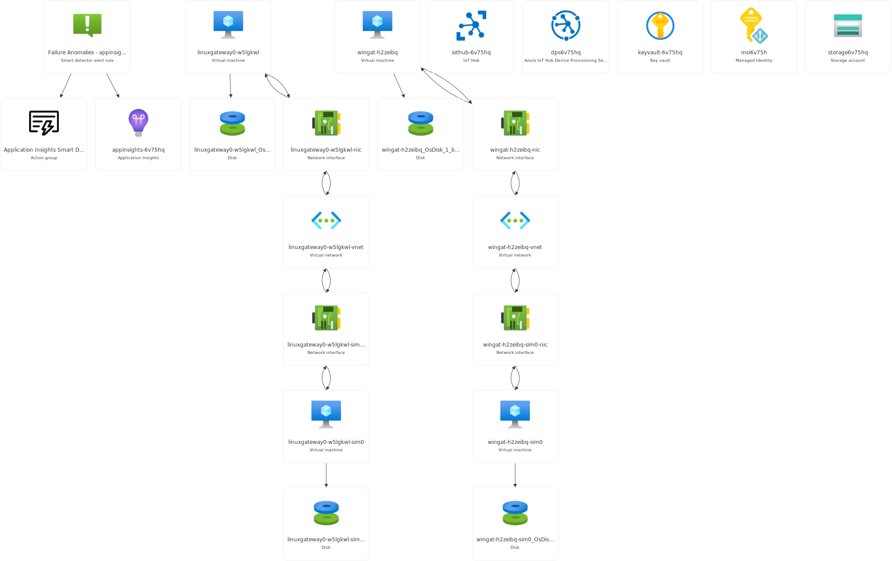

- [Overview](#overview)
- [Stage 1](#stage-1)
  - [Initial Research/Prerequisites](#initial-researchprerequisites)
  - [Deployment Issues](#deployment-issues)
- [Stage 2](#stage-2)
  - [Setup](#setup)
  - [Architecture](#architecture)
  - [NetworkWatcherRG](#networkwatcherrg)
  - [iiot\_simulation](#iiot_simulation)
  - [Costs involved (3 test/simulation deployments with no actual data/devices connected)](#costs-involved-3-testsimulation-deployments-with-no-actual-datadevices-connected)
- [Stage 3](#stage-3)

# Overview
Model-driven development (MDD) is an approach to software development that emphasizes the use of models to design and specify systems before implementing them in code. This approach is gaining popularity in various domains, including the Industrial Internet of Things (IIoT). IIoT refers to the integration of industrial processes with smart sensors and devices connected to the internet, enabling data collection, analysis, and automation in industrial settings.

Here's how we can apply it in the context of IIoT:

1. System Modeling:
    - Domain-Specific Modeling Languages: Create domain-specific modeling languages tailored to the requirements of IIoT applications. These languages can capture the specific concepts, relationships, and constraints relevant to industrial processes.
    - High-Level Abstractions: Use high-level abstractions to model complex systems, making it easier to understand, communicate, and validate system requirements.
2. Requirements Specification:
    - Formalization of Requirements: Translate business and functional requirements into formal models. This helps ensure a clear understanding of the system's behavior and functionality before moving on to implementation.
3. Code Generation:
    - Automatic Code Generation: Generate code from the models, reducing the likelihood of errors introduced during manual coding. This can improve productivity and maintain consistency between the design and implementation.
4. Consistency and Traceability:
    - Traceability: Establish traceability between different levels of the model (requirements, design, implementation) to ensure that changes made in one part of the development process are reflected appropriately throughout the system.
5. Testing and Validation:
    - Model-Based Testing: Use models to automatically generate test cases, facilitating more efficient and comprehensive testing. This can improve the reliability and robustness of IIoT systems.
6. Adaptability and Reusability:
    - Model Reusability: Reuse models for similar components or systems, promoting consistency across different projects and reducing development time.
    - Adaptability to Changes: Easily adapt to changes in requirements by modifying the models rather than rewriting code. This is particularly important in dynamic IIoT environments where requirements may evolve over time.
7. Collaboration and Communication:
    - Collaborative Modeling: Facilitate collaboration among multidisciplinary teams by using models as a common language for communication. This can enhance understanding and alignment across different stakeholders involved in IIoT development.
8. Maintenance and Evolution:
    - Simplified Maintenance: Models can serve as documentation that helps with system maintenance. Changes to the system can be made more efficiently by updating the models and regenerating the code.

In summary, model-driven development in the context of IIoT can bring benefits such as improved system understanding, faster development cycles, enhanced collaboration, and increased adaptability to changes in the industrial landscape. It aligns well with the complexity and requirements of IIoT systems, where clear specifications and efficient development processes are crucial.

AMDD is the agile version of Model Driven Development (MDD).\
MDD: The difference with AMDD is that instead of creating extensive models before writing source code you instead create gile models which are just barely good enough that drive your overall development efforts.\
AMDD is a critical strategy for scaling agile software development beyond the small, colocated team approach that we saw during the first stage of agile adoption.

# Stage 1
## Initial Research/Prerequisites

We used the information and documentation available from Microsoft - https://learn.microsoft.com/en-us/azure/industrial-iot/tutorial-deploy-industrial-iot-platform - along with a minimal simulation deployment that can be found on https://github.com/Azure/Industrial-IoT. We are planning to extend/modify the simulation to fit our needs. If not possible, we'll set the resources by hand.

The first issue we ran into was the fact that we require the full Microsoft stack - Azure, Graph, Powershell - just to deploy the initial test via a `deploy.sh` script.

## Deployment Issues
The second issue was the type of VMs and their virtualization type. We found an issue documented here - https://github.com/Azure/Industrial-IoT/issues/1203 - and a workaround created here - https://github.com/Azure/Industrial-IoT/pull/1516. The final working command is `./deploy.sh --version 2.8.2 --type simulation -gatewayVMSKU Standard_D1_v2 -OPCPLCVMSKU Standard_D2_v2`. It requires an Azure Subscription to be available.

# Stage 2
## Setup
After the issues and prerequisites from `Stage 1` we have a working environment (locally & cloud).

Locally, there's a `.env` file created with the following:
```
PCS_RESOURCE_GROUP=iiot_simulation
PCS_KEYVAULT_URL=https://keyvault-6v75hq.vault.azure.net/
PCS_AUTH_PUBLIC_CLIENT_APPID=<UUID>
PCS_AUTH_TENANT=<UUID>
PCS_IMAGES_TAG=2.8.2
```

It can be used to locally develop new components along with testing the examples from `samples` folder.

## Architecture 
Azure OPC Publisher and the optional Industrial IoT Web service allows plant operators to discover OPC UA enabled servers in a factory network and register them in Azure IoT Hub. Operations personnel can subscribe to and react to events on the factory floor from anywhere in the world. The APIs mirror the OPC UA services and are secured through IoT Hub or optionally using OAUTH authentication and authorization backed by Azure Active Directory (AAD). This enables your applications to browse server address spaces or read/write variables and execute methods using IoT Hub, MQTT or HTTPS with simple JSON payloads.

OPC Publisher is a module that runs on Azure IoT Edge and bridges the gap between industrial assets and the Microsoft Azure cloud. It connects to OPC UA server systems and publishes telemetry data to Azure IoT Hub in various formats.

The Azure Industrial IoT companion web (OPC Publisher Web API) service is an optional component included in this repo and provides cloud side APIs to configure and operate the OPC Publisher module.

OPC Unified Architecture (UA), released in 2008, is a platform-independent, service-oriented interoperability standard. OPC UA is used by various industrial systems and devices such as industry PCs, PLCs, and sensors. OPC UA integrates the functionality of the OPC Classic specifications into one extensible framework with built-in security. It is a standard that is driven by the OPC Foundation.

The following diagram (taken from [docs](https://github.com/Azure/Industrial-IoT/blob/main/docs/readme.md)) shows how the OPC Publisher and optional REST Api integrate with Azure IoT Hub, Azure IoT Edge and other Azure services:



The current state of the IIoT system is represented by the following diagram generated in our Azure account:


The resource groups involved in the current stage are:
- NetworkWatcherRG
- iiot_simulation

## NetworkWatcherRG
| NAME	                    | TYPE	            | LOCATION    | LINK |
| ------------------------- | ----------------- | ----------- | ---- |
| NetworkWatcher_westeurope	| Network Watcher	| West Europe | https://learn.microsoft.com/en-us/azure/network-watcher/network-watcher-overview |

Azure Network Watcher provides a suite of tools to monitor, diagnose, view metrics, and enable or disable logs for Azure IaaS (Infrastructure-as-a-Service) resources. Network Watcher enables you to monitor and repair the network health of IaaS products like virtual machines (VMs), virtual networks (VNets), application gateways, load balancers, etc. Network Watcher isn't designed or intended for PaaS monitoring or Web analytics.

## iiot_simulation
| NAME	                                                               | TYPE	                                         | LOCATION    |
| -------------------------------------------------------------------- | ----------------------------------------------- | ----------- |
| appinsights-6v75hq	                                               | Application Insights	                         | West Europe |
| Application Insights Smart Detection                                 | Action group	                                 | Global	   |
| dps |6v75hq	                                                       | Azure IoT Hub Device Provisioning Service (DPS) | West Europe |
| Failure Anomalies - appinsights-6v75hq                               | Smart detector alert rule	                     | Global	   |
| iot |hub-6v75hq	                                                   | IoT Hub	                                     | West Europe |
| keyvault-6v75hq	                                                   | Key vault	                                     | West Europe |
| linuxgateway0-w5lgkwl	                                               | Virtual machine	                             | West Europe |
| linuxgateway0-w5lgkwl-nic	                                           | Network Interface	                             | West Europe |
| linuxgateway0-w5lgkwl-sim0	                                       | Virtual machine	                             | West Europe |
| linuxgateway0-w5lgkwl-sim0-nic	                                   | Network Interface	                             | West Europe |
| linuxgateway0-w5lgkwl-sim0_OsDisk_1_cb2e67ff0ec045debec591519d9bf384 | Disk	                                         | West Europe |
| linuxgateway0-w5lgkwl-vnet	                                       | Virtual network	                             | West Europe |
| linuxgateway0-w5lgkwl_OsDisk_1_4e27560a414b443eac60582bdfed7fac	   | Disk	                                         | West Europe |
| msi6v75h	                                                           | Managed Identity	                             | West Europe |
| storage6v75hq	                                                       | Storage account	                             | West Europe |
| wingat-h2zeibq	                                                   | Virtual machine	                             | West Europe |
| wingat-h2zeibq-nic	                                               | Network Interface	                             | West Europe |
| wingat-h2zeibq-sim0	                                               | Virtual machine	                             | West Europe |
| wingat-h2zeibq-sim0-nic	                                           | Network Interface	                             | West Europe |
| wingat-h2zeibq-sim0_OsDisk_1_95bf44ab52ee4f01afa47a32792c4891        | Disk	                                         | West Europe |
| wingat-h2zeibq-vnet	                                               | Virtual network	                             | West Europe |
| wingat-h2zeibq_OsDisk_1_b08a744f902745a58871f415bfdb82f3	           | Disk	                                         | West Europe |

| TYPE                                            | LINK | DESCRIPTION |
| ----------------------------------------------- | ---- | ----------- |
| Application Insights                            | [Info](https://learn.microsoft.com/en-us/azure/azure-monitor/app/app-insights-overview) | Application Insights provides many experiences to enhance the performance, reliability, and quality of your applications. | 
| Action group                                    | [Info](https://learn.microsoft.com/en-us/azure/azure-monitor/alerts/action-groups) | When Azure Monitor data indicates that there might be a problem with your infrastructure or application, an alert is triggered. Alerts can contain action groups, which are a collection of notification preferences. Azure Monitor, Azure Service Health, and Azure Advisor use action groups to notify users about the alert and take an action. | 
| Azure IoT Hub Device Provisioning Service (DPS) | [Info](https://learn.microsoft.com/en-us/azure/iot-dps/) | The IoT Hub Device Provisioning Service (DPS) is a helper service for IoT Hub that enables zero-touch, just-in-time provisioning to the right IoT hub without requiring human intervention, allowing customers to provision millions of devices in a secure and scalable manner. | 
| Smart detector alert rule                       | [Info](https://learn.microsoft.com/en-us/azure/azure-monitor/alerts/proactive-diagnostics) | Smart detection automatically warns you of potential performance problems and failure anomalies in your web application. It performs proactive analysis of the telemetry that your app sends to Application Insights. If there's a sudden rise in failure rates or abnormal patterns in client or server performance, you get an alert. This feature needs no configuration. It operates if your application sends enough telemetry. | 
| IoT Hub                                         | [Info](https://learn.microsoft.com/en-us/azure/iot-hub/iot-concepts-and-iot-hub) | Azure IoT Hub is a managed service hosted in the cloud that acts as a central message hub for communication between an IoT application and its attached devices. You can connect millions of devices and their backend solutions reliably and securely. Almost any device can be connected to an IoT hub. | 
| Key vault                                       | [Info](https://learn.microsoft.com/en-us/azure/key-vault/general/overview) | Azure Key Vault is a service that provides centralized secrets management, with full control over access policies and audit history. When an app setting or connection string is a key vault reference, your application code can use it like any other app setting or connection string. | 
| Virtual machine                                 | [Info](https://azure.microsoft.com/en-us/products/virtual-machines) | Azure Virtual Machines are image service instances that provide on-demand and scalable computing resources with usage-based pricing. | 
| Network Interface                               | [Info](https://learn.microsoft.com/en-us/azure/virtual-network/virtual-network-network-interface?tabs=azure-portal) | A network interface (NIC) enables an Azure virtual machine (VM) to communicate with internet, Azure, and on-premises resources. This article explains how to create, view and change settings for, and delete a NIC. | 
| Disk                                            | [Info](https://learn.microsoft.com/en-us/azure/virtual-machines/managed-disks-overview) | Azure managed disks are block-level storage volumes that are managed by Azure and used with Azure Virtual Machines. Managed disks are like a physical disk in an on-premises server but, virtualized. With managed disks, all you have to do is specify the disk size, the disk type, and provision the disk. Once you provision the disk, Azure handles the rest. | 
| Virtual network                                 | [Info](https://learn.microsoft.com/en-us/azure/virtual-network/virtual-networks-overview) | Azure Virtual Network is a service that provides the fundamental building block for your private network in Azure. An instance of the service (a virtual network) enables many types of Azure resources to securely communicate with each other, the internet, and on-premises networks. These Azure resources include virtual machines (VMs). A virtual network is similar to a traditional network that you'd operate in your own datacenter. But it brings extra benefits of the Azure infrastructure, such as scale, availability, and isolation. | 
| Managed Identity                                | [Info](https://learn.microsoft.com/en-us/entra/identity/managed-identities-azure-resources/overview) | A common challenge for developers is the management of secrets, credentials, certificates, and keys used to secure communication between services. Managed identities eliminate the need for developers to manage these credentials. While developers can securely store the secrets in Azure Key Vault, services need a way to access Azure Key Vault. Managed identities provide an automatically managed identity in Microsoft Entra ID for applications to use when connecting to resources that support Microsoft Entra authentication. Applications can use managed identities to obtain Microsoft Entra tokens without having to manage any credentials. | 
| Storage account                                 | [Info](https://learn.microsoft.com/en-us/azure/storage/common/storage-account-overview) | An Azure storage account contains all of your Azure Storage data objects: blobs, files, queues, and tables. The storage account provides a unique namespace for your Azure Storage data that's accessible from anywhere in the world over HTTP or HTTPS. Data in your storage account is durable and highly available, secure, and massively scalable. |

Applications:\
iiot-simulation-client\
iiot-simulation-service\
iiot-simulation-web

## Costs involved (3 test/simulation deployments with no actual data/devices connected)
| ResourceGroup	    | Resource	                                                           | ResourceType	             | Cost	       | Currency |
| ----------------- | -------------------------------------------------------------------- | --------------------------- | ----------- | -------- |
| iiot_simulation	| iothub-6v75hq_[25348359]	                                           | IoT Hub	                 | 0.762313652 | EUR      |
| iiot_simulation	| iothub-6v75hq_[25348386]	                                           | IoT Hub	                 | 0.762313652 | EUR      |
| iiot_simulation	| iothub-6v75hq_[25348410]	                                           | IoT Hub	                 | 0.762313652 | EUR      |
| iiot_simulation	| wingat-h2zeibq	                                                   | Virtual machine	         | 0.189153388 | EUR      |
| iiot_simulation	| wingat-h2zeibq-sim0	                                               | Virtual machine	         | 0.152128327 | EUR      |
| iiot_simulation	| linuxgateway0-w5lgkwl-sim0                                           | Virtual machine	         | 0.149985673 | EUR      |
| iiot_simulation	| linuxgateway0-w5lgkwl	                                               | Virtual machine	         | 0.075952303 | EUR      |
| iiot_simulation	| wingat-h2zeibq_osdisk_1_b08a744f902745a58871f415bfdb82f3	           | Disk	                     | 0.028465375 | EUR      |
| iiot_simulation	| linuxgateway0-w5lgkwl_osdisk_1_4e27560a414b443eac60582bdfed7fac	   | Disk	                     | 0.002016735 | EUR      |
| iiot_simulation	| linuxgateway0-w5lgkwl-sim0_osdisk_1_cb2e67ff0ec045debec591519d9bf384 | Disk	                     | 0.002016735 | EUR      |
| iiot_simulation	| wingat-h2zeibq-sim0_osdisk_1_95bf44ab52ee4f01afa47a32792c4891	       | Disk	                     | 0.002016735 | EUR      |
| iiot_simulation	| dps6v75hq	                                                           | Device Provisioning Service | 0.000756215 | EUR      |

# Stage 3
To be implemented: extend samples or develop new components.
