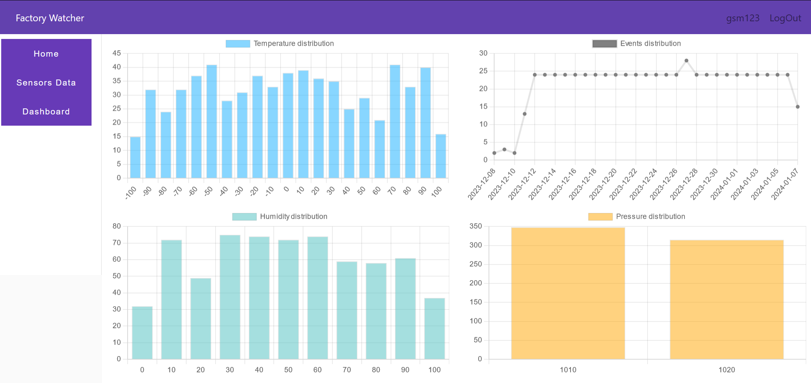
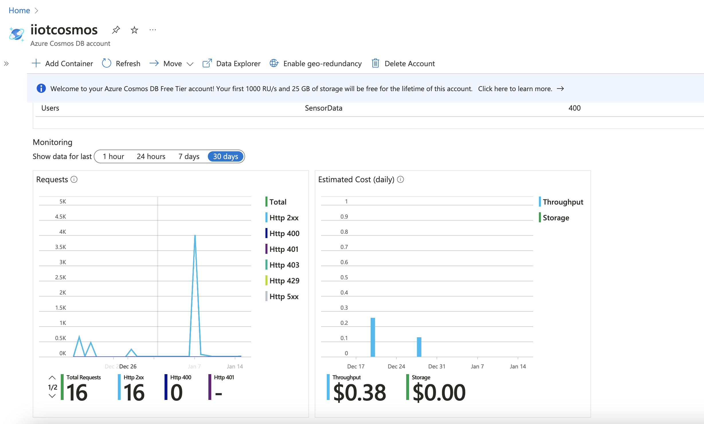
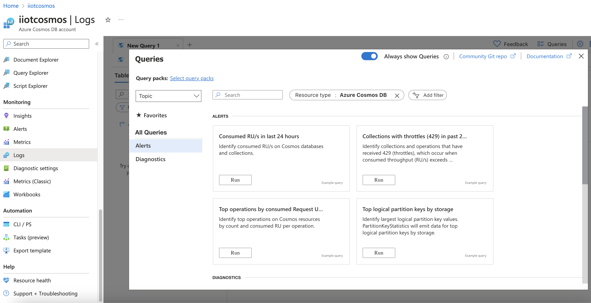
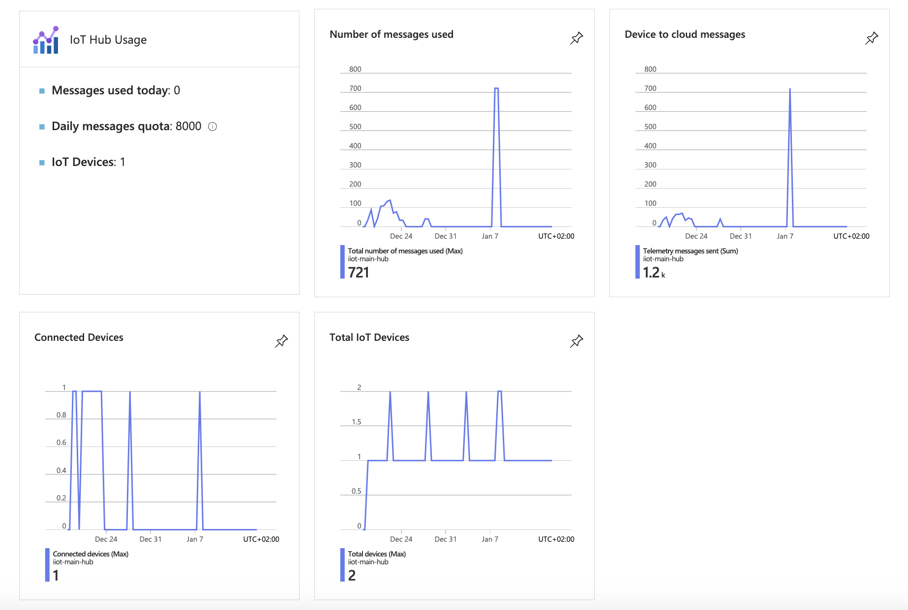
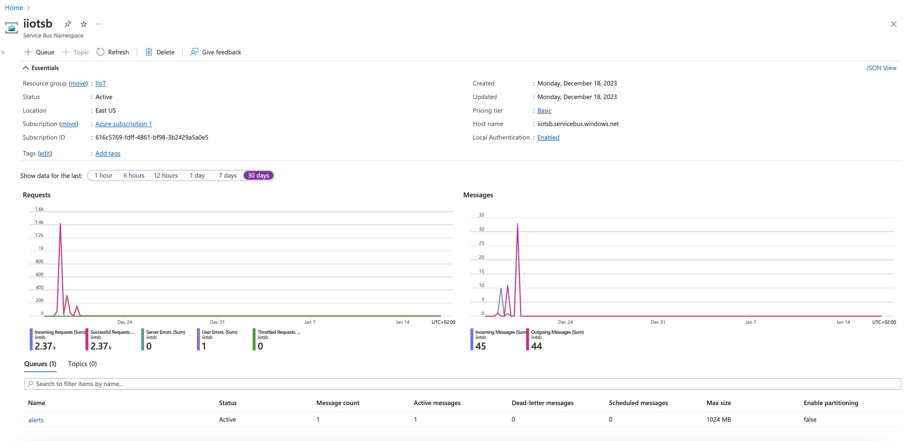
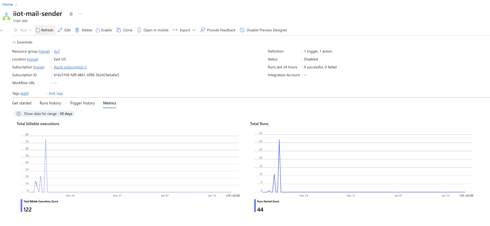
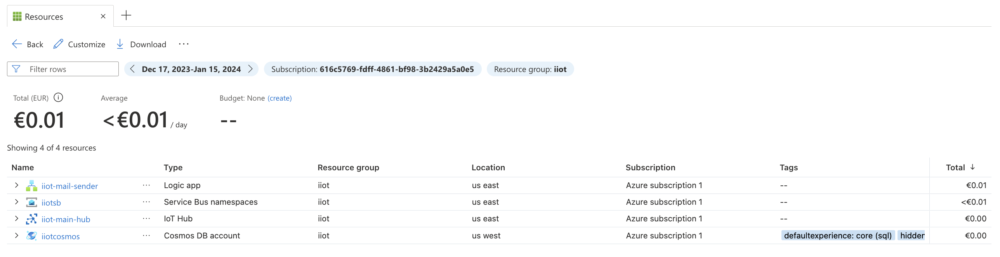
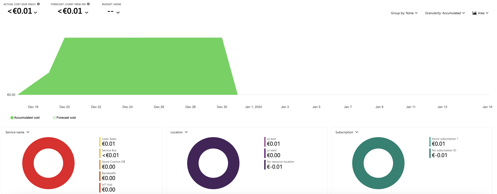

# FactoryWatcher

FactoryWatcher: Sophisticated Component Surveillance

- [FactoryWatcher](#factorywatcher)
- [Project description](#project-description)
- [Coordinator(s)](#coordinators)
- [Team members](#team-members)
- [State of Art](#state-of-art)
  - [Domain terms](#domain-terms)
  - [Academic Papers in IoT area](#academic-papers-in-iot-area)
- [Related Work](#related-work)
  - [Past years projects](#past-years-projects)
  - [Companies](#companies)
- [Risk Assessment](#risk-assessment)
- [Our solution](#our-solution)
- [AI code generation](#ai-code-generation)
- [Results and evaluation](#results-and-evaluation)
- [Future work](#future-work)

## Project description

FactoryWatcher is an innovative Internet of Things (IoT) project designed to monitor factory operations in real time. In today's fast-paced manufacturing environment, ensuring operational efficiency, safety, and sustainability are paramount. FactoryWatcher addresses these concerns by leveraging IoT technology to develop a comprehensive solution to monitor and manage various aspects of factory operations.

Project goals:

1. Real-time monitoring: FactoryWatcher provides real-time data on critical aspects of factory operations. This includes machine performance, energy consumption, environmental conditions and the status of various production processes.
2. Security and Compliance: The system continuously monitors for security violations and compliance issues, detects and alerts users in case of potential threats and ensures compliance with safety protocols and regulatory standards.
3. Predictive Maintenance: FactoryWatcher uses predictive analytics to predict equipment maintenance needs. This proactive approach minimizes unplanned downtime, reduces maintenance costs, and increases overall production efficiency.
4. Data Analytics: Collected data is stored and analyzed to identify patterns and trends, providing valuable insights for process optimization, cost reduction, and overall operational improvement.
5. User-friendly interface: The FactoryWatcher system has a user-friendly interface that can be accessed through web and mobile applications. This allows factory managers and employees to access real-time data, receive alerts, and make informed decisions to improve factory efficiency and safety.

Main components:

1. Sensors: Deploy a network of sensors throughout the factory to collect data on mechanical, environmental, and safety parameters.
2. Data collection: Collect data from sensors and send it securely to a central server.
3. Data Analytics: Implement machine learning and AI algorithms to analyze data and generate actionable insights.
4. Alarm System: Establish a robust alarm mechanism to notify factory management and employees of critical events and potential problems.
5. User Interface: Develop easy-to-use web and mobile interfaces to access real-time data, reports, and alerts.
6. Cloud Infrastructure: Leverage cloud-based storage and computing resources for scalability and data accessibility.
7. Security and Compliance: Implement rigorous security measures to protect sensitive factory data and ensure compliance with data protection regulations.

Advantage:

1. Improve operational efficiency
2. Reduce downtime and maintenance costs
3. Improved security and compliance
4. Data-driven decision making for process optimization

## Coordinator(s)

Gavriluț Dragoș Teodor\
TBD

## Team members

Gherghe Tudor-Alexandru\
Smoc George-Marian (\*)\
Mutu Gheorghiță

\* Team Leader (negociates points, asseses the current type of the project, clarifies misunderstandings related to the tasks at hands)

## State of Art

### Domain terms

#### [IoT (Internet of things)](https://en.wikipedia.org/wiki/Internet_of_things)

The Internet of things (IoT) describes devices with sensors, processing ability, software and other technologies that connect and exchange data with other devices and systems over the Internet or other communications networks. The Internet of things encompasses electronics, communication and computer science engineering. Internet of things has been considered a misnomer because devices do not need to be connected to the public internet, they only need to be connected to a network,and be individually addressable.

#### [IIoT (Internet of things)](https://en.wikipedia.org/wiki/Industrial_internet_of_things)

The industrial internet of things (IIoT) refers to interconnected sensors, instruments, and other devices networked together with computers' industrial applications, including manufacturing and energy management. This connectivity allows for data collection, exchange, and analysis, potentially facilitating improvements in productivity and efficiency as well as other economic benefits. The IIoT is an evolution of a distributed control system (DCS) that allows for a higher degree of automation by using cloud computing to refine and optimize the process controls.

#### [Edge computing](https://en.wikipedia.org/wiki/Edge_computing)

Edge computing is a distributed computing paradigm that brings computation and data storage closer to the sources of data. This is expected to improve response times and save bandwidth. Edge computing is an architecture rather than a specific technology, and a topology- and location-sensitive form of distributed computing.

The origins of edge computing lie in content distributed networks that were created in the late 1990s to serve web and video content from edge servers that were deployed close to users. In the early 2000s, these networks evolved to host applications and application components on edge servers, resulting in the first commercial edge computing services that hosted applications such as dealer locators, shopping carts, real-time data aggregators, and ad insertion engines.

Internet of things (IoT) is an example of edge computing. A common misconception is that edge and IoT are synonymous.

#### [Manufacturing/Industry 4.0](https://en.wikipedia.org/wiki/Fourth_Industrial_Revolution)

"Fourth Industrial Revolution", "4IR", or "Industry 4.0"is a buzzword neologism describing rapid technologicaladvancement in the 21st century.

The term was popularised in 2016 by Klaus Schwab, theWorld Economic Forum founder and executive chairman, whosays that the changes show a significant shift inindustrial capitalism.

A part of this phase of industrial change is the joiningof     technologies like artificial intelligence, geneediting, to     advanced robotics that blur the linesbetween the physical,     digital, and biological worlds.

[From IBM:](https://www.ibm.com/topics/industry-4-0)

Industry 4.0 is revolutionizing the way companies manufacture, improve and distribute their products. Manufacturers are integrating new technologies, including Internet of Things (IoT), cloud computing and analytics, and AI and machine learning into their production facilities and throughout their operations.

These smart factories are equipped with advanced sensors, embedded software and robotics that collect and analyze data and allow for better decision making. Even higher value is created when data from production operations is combined with operational data from ERP, supply chain, customer service and other enterprise systems to create whole new levels of visibility and insight from previously siloed information.

### Academic Papers in IoT area

#### [Practical Guide to Smart Factory Transition Using IoT, Big Data and Edge Analytics (2021)](https://ieeexplore.ieee.org/abstract/document/8478188)

In this age of digital disruption, every industry is undergoing digital transformation and manufacturing is no exception. Since Internet-of-Things (IoT) and Big Data have immense transformational potential, manufacturing companies are in a race to implement IoT-based solutions to innovate, improve productivity, reduce costs, and improve their market share. As companies try to embrace IoT, one of the key challenges that they face is to come up with an “Integrated Approach.” “Integrated Approach” includes fitting IoT in the overall system landscape, selecting the right use case, and evaluating and deciding on implementation approach. This paper provides guidance to transform legacy manufacturing unit to a smart factory conforming to Industry 4.0 principles. It presents a reference architecture and offers various practical approaches for consideration to embark on digital journey. It details each approach along with its own benefits and challenges and helps organizations to realistically determine faster time-to-market versus its long-term goals. This paper attempts to perform a deep dive on various aspects of integrated approach which will be immensely helpful for organizations and researchers alike.

#### [Mobility-aware hierarchical fog computing framework for Industrial Internet of Things (IIoT) (2022)](https://journalofcloudcomputing.springeropen.com/articles/10.1186/s13677-022-00345-y)

The Industrial Internet of Things (IIoTs) is an emerging area that forms the collaborative environment for devices to share resources. In IIoT, many sensors, actuators, and other devices are used to improve industrial efficiency. As most of the devices are mobile; therefore, the impact of mobility can be seen in terms of low-device utilization. Thus, most of the time, the available resources are underutilized. Therefore, the inception of the fog computing model in IIoT has reduced the communication delay in executing complex tasks. However, it is not feasible to cover the entire region through fog nodes; therefore, fog node selection and placement is still the challenging task. This paper proposes a multi-level hierarchical fog node deployment model for the industrial environment. Moreover, the scheme utilized the IoT devices as a fog node; however, the selection depends on energy, path/location, network properties, storage, and available computing resources. Therefore, the scheme used the location-aware module before engaging the device for task computation. The framework is evaluated in terms of memory, CPU, scalability, and system efficiency; also compared with the existing approach in terms of task acceptance rate. The scheme is compared with xFogSim framework that is capable to handle workload upto 1000 devices. However, the task acceptance ratio is higher in the proposed framework due to its multi-tier model. The workload acceptance ratio is 85% reported with 3000 devices; whereas, in xFogsim the ratio is reduced to approx. 68%. The primary reason for high workload acceptation is that the proposed solution utilizes the unused resources of the user devices for computations.

#### [Advances in Sensor Technologies in the Era of Smart Factory and Industry 4.0 (2020)](https://www.mdpi.com/1424-8220/20/23/6783)

The evolution of intelligent manufacturing has had a profound and lasting effect on the future of global manufacturing. Industry 4.0 based smart factories merge physical and cyber technologies, making the involved technologies more intricate and accurate; improving the performance, quality, controllability, management, and transparency of manufacturing processes in the era of the internet-of-things (IoT). Advanced low-cost sensor technologies are essential for gathering data and utilizing it for effective performance by manufacturing companies and supply chains. Different types of low power/low cost sensors allow for greatly expanded data collection on different devices across the manufacturing processes. While a lot of research has been carried out with a focus on analyzing the performance, processes, and implementation of smart factories, most firms still lack in-depth insight into the difference between traditional and smart factory systems, as well as the wide set of different sensor technologies associated with Industry 4.0. This paper identifies the different available sensor technologies of Industry 4.0, and identifies the differences between traditional and smart factories. In addition, this paper reviews existing research that has been done on the smart factory; and therefore provides a broad overview of the extant literature on smart factories, summarizes the variations between traditional and smart factories, outlines different types of sensors used in a smart factory, and creates an agenda for future research that encompasses the vigorous evolution of Industry 4.0 based smart factories.

#### [Impact of IoT on Manufacturing Industry 4.0: A New Triangular Systematic Review (2021)](https://www.mdpi.com/2071-1050/13/22/12506)

The Internet of Things (IoT) has realised the fourth industrial revolution concept; however, its applications in the manufacturing industry are relatively sparse and primarily investigated without contextual peculiarities. Our research undertakes an intricate critical review to investigate significant aspects of IoT applications in the manufacturing Industry 4.0 perspective to address this gap. We adopt a systematic literature review approach by Denyer and Tranfield (2009) to carry out critical analyses that help develop future research domains based on empirical studies. We describe key knowledge gaps in the existing literature and empirical studies by exploring the main contribution categories and finding six critical differences between traditional and manufacturing Industry 4.0 and 10 enablers and 11 challenges of IoT applications. Finally, an agenda for future research is proposed with 11 research domains to focus on the recognised gaps.

#### [IoT, IIoT and Cyber-Physical Systems Integration in the SEPT Learning Factory (2019)](https://www.sciencedirect.com/science/article/pii/S2351978919303828)

The SEPT Learning Factory (LF) is a state-of-the art learning environment for students with a focus on designing, prototyping, manufacturing, and testing processes that incorporate key aspects of IoT, IIoT, and Industry 4.0. The infrastructure to support the operations of various cyber-physical system components in the LF consist of critical elements such as computing and networking components. The prototyping and production system components are integrated with digital technology components. This paper describes the use of these elements in the LF. Several messaging platforms used for implementing IoT and IIoT protocols are available to students for data collection, visualization and analytics. This paper describes the use of these protocols, the implementation and integration of IoT and IIoT stations, cyber-physical system control stations, manufacturing machines and collaborative robots.

#### [An Internet of Things Approach for Water Efficiency: A Case Study of the Beverage Factory (2021)](https://www.mdpi.com/2071-1050/13/6/3343)

There is a lack of knowledge among food manufacturers about adopting the Internet of Things (IoT)-based water monitoring system and its ability to support water minimisation activities. It is therefore necessary to investigate the applicability of IoT-based real-time water monitoring systems in a real food manufacturing environment to pursue water-saving opportunities accordingly. This article aims to propose an architecture of an IoT-based water-monitoring system needed for real-time monitoring of water usage, and address any water inefficiencies within food manufacturing. This article looks at a study conducted in a food beverage factory where an IoT-based real-time water monitoring system is implemented to analyse the complete water usage in order to devise solutions and address water overconsumption/wastage during the manufacturing process. The successful implementation of an IoT-based real-time water monitoring system offered the beverage factory a detailed analysis of the water consumption and insights into the water hotspots that needed attention. This action initiated several water-saving project opportunities, which contributed to the improvement of water sustainability and led to an 11% reduction in the beverage factory’s daily water usage.

#### [Energy-Efficient Edge Offloading in Heterogeneous Industrial IoT Networks for Factory of Future (2020)](https://ieeexplore.ieee.org/abstract/document/9216066)

The ultra-reliable and low latency communication (URLLC) and massive machine type communication (mMTC) in 5G are envisioned to support intelligent automation in the heterogeneous Factory of Future (FoF) networks, and Mobile-edge computing (MEC) is considered to be a promising system for enabling real-time task processing at the edge of the network. In the future factory, production machines, and environmental monitoring devices will be endowed with the wireless connecting for mobility. These devices are deployed for running complicated real-time tasks. To make such mission-critical tasks being processed in time, parts of the tasks should be completed with the assistance of the edge server or even the cloud. In this work, we jointly investigate the partial task offloading, computation, and communication (licensed and unlicensed) resource allocation problem in the trade-off between overall power consumption and quality of service (QoS) satisfaction. A 2-tier MEC-cloud framework is provided, wherein the IoT mobile devices (MDs) are able to partition the tasks into segments and offload them to the MEC and the cloud server. Considering the limits of communication and computation resources, we proposed a mechanism call 5G and NR-U opportunity-cost-based offloading algorithm (5G/NR-U OCBOA) to optimize resource allocation. Within the mechanism, there are two proposed algorithms, 5G OCBOA is for the licensed-only case, and NR-U OCBOA dedicates on unlicensed one. We iteratively perform the two algorithms to get the final solution. The simulation results show that our low-complexity algorithms almost outperform the other benchmark greedy algorithms. The proposed algorithm is up to 59.3% MD blocking probability less, up to 58.7% power saving gain, and up to 47.6% more QoS gain.

#### [Towards IoT-driven Process Event Log Generation for Conformance Checking in Smart Factories (2020)](https://ieeexplore.ieee.org/document/9233283)

[PDF source](https://orbit.dtu.dk/files/222359998/2020_fopas.pdf)

The Internet of Things (IoT) enables software-based access to vast amounts of data streams from sensors measuring physical and virtual properties of smart devices and their surroundings. While sophisticated means for the control and data analysis of single IoT devices exist, a more process-oriented view of IoT systems is often missing. Such a lack of process awareness hinders the development of process-based systems on top of IoT environments and the application of process mining techniques for process analysis and optimization in IoT. We propose a framework for the stepwise correlation and composition of raw IoT sensor streams with events and activities on a process level based on Complex Event Processing (CEP). From this correlation we derive refined process event logs-possibly with ambiguities-that can be used for process analysis at runtime (i. e., online). We discuss the framework using examples from a smart factory.

#### [Internet of Things for Smart Factories in Industry 4.0, A Review (2023)](https://www.researchgate.net/publication/370264717_Internet_of_Things_for_Smart_Factories_in_Industry_40_A_Review)

The Internet of Things (IoT) is playing a significant role in the transformation of traditional factories into smart factories in Industry 4.0 by using network of interconnected devices, sensors, and software to monitor and optimize the production process. Predictive maintenance using the IoT in smart factories can also be used to prevent machine failures, reduce downtime, and extend the lifespan of equipment. To monitor and optimize energy usage during part manufacturing, manufacturers can obtain real-time insights into energy consumption patterns by deploying IoT sensors in smart factories. Also, IoT can provide a more comprehensive view of the factory environment to enhance workplace safety by identifying potential hazards and alerting workers to potential dangers. Suppliers can use IoT-enabled tracking devices to monitor shipments and provide real-time updates on delivery times and locations in order to analyze and optimize the supply chain in smart factories. Moreover, IoT is a powerful technology which can optimize inventory management in smart factories to reduce costs, improve efficiency, and provide real-time visibility into inventory levels and movements. To analyze and enhance the impact of internet of thing in smart factories of industry 4.0, a review is presented. Applications of internet of things in smart factories such as predictive maintenance, asset tracking, inventory management, quality control, production process monitoring, energy efficiency and supply chain optimization are reviewed. Thus, by analyzing the application of IoT in smart factories of Industry 4.0, new ideas and advanced methodologies can be provided to improve quality control and optimize part production processes.

#### [An end-to-end big data analytics platform for IoT-enabled smart factories: A case study of battery module assembly system for electric vehicles (2022)](https://www.sciencedirect.com/science/article/pii/S0278612522000450)

Within the concept of factories of the future, big data analytics systems play a critical role in supporting decision-making at various stages across enterprise processes. However, the design and deployment of industry-ready, lightweight, modular, flexible, and cost efficient big data analytics solutions remains one of the main challenges towards the Industry 4.0 enabled digital transformation. This paper presents an end-to-end IoT-based big data analytics platform that consists of five interconnected layers and several components for data acquisition, integration, storage, analytics and visualisation purposes. The platform architecture benefits from state-of-the-art technologies and integrates them in a systematic and interoperable way with clear information flows. The developed platform has been deployed in an electric vehicle battery module assembly automation system designed by the Automation Systems Group at the University of Warwick, the UK. The developed proof-of-concept solution demonstrates how a wide variety of tools and methods can be orchestrated to work together aiming to support decision-making and to improve both process and product qualities in smart manufacturing environments.

#### [iRobot-Factory: An intelligent robot factory based on cognitive manufacturing and edge computing (2018)](https://www.sciencedirect.com/science/article/abs/pii/S0167739X1831183X)

The Internet of Things (IoT) and Artificial Intelligence (AI) have been driving forces in propelling the technical innovation of intelligent manufacturing, promoting economic growth, and improving the quality of people’s lives. In an intelligent factory, introducing edge computing is conducive to expanding the computing resources, the network bandwidth, and the storage capacity of the cloud platform to the IoT edge, as well as realizing the resource scheduling and data uplink and downlink processing during the manufacturing and production processes. Moreover, the emotion recognition and interaction of the Affective Interaction Intelligence Robot (iRobot), with the IoT cloud platform as the infrastructure and AI technology as the core competitiveness, can better solve the psychological problems of the user. Accordingly, this has become a hot research topic in the field of intelligent manufacturing. In this paper, we describe an intelligent robot factory (iRobot-Factory), adopt a highly interconnected and deeply integrated intelligent production line, and introduce the overall structure, composition, characteristics, and advantages of such a factory in details from the two aspects of cognitive manufacturing and edge computing. Then, we describe the implementation of the volume production of iRobot using iRobot-Factory and look at the system performance experimental results and analysis of the iRobot-Factory and a traditional factory. The experimental results show that our scheme significantly improved both the chip assembly and the production efficiency, while the number of system instructions also decreased significantly. In addition, we discuss some open issues relating to cloud-end fusion, load balancing, and personalized robots to make reference to promoting the emotion recognition and interaction experience of users.

#### [A method of NC machine tools intelligent monitoring system in smart factories (2019)](https://www.sciencedirect.com/science/article/abs/pii/S0736584518301960)

The construction of effectual connection to bridge the gap between physical machine tools and upper software applications is one of the inherent requirements for smart factories. The difficulties in this issue lies in the lack of effective and appropriate means for real-time data acquisition, storage and processing in monitoring and the post workflows. The rapid advancements in Internet of things (IoT) and information technology have made it possible for the realization of this scheme, which have become an important module of the concepts such as “Industry 4.0”, etc. In this paper, a framework of bi-directional data and control flows between various machine tools and upper-level software system is proposed, within which several key stumbling blocks are presented, and corresponding solutions are subsequently deeply investigated and analyzed. Through monitoring manufacturing big data, potential essential information are extracted, providing useful guides for practical production and enterprise decision-making. Based on the integrated model, an NC machine tool intelligent monitoring and data processing system in smart factories is developed. Typical machine tools, such as Siemens series, are the main objects for investigation. The system validates the concept and performs well in the complex manufacturing environment, which will be a beneficial attempt and gain its value in smart factories.

## Related Work

### Past years projects
We are discussing here only about the repositories we had access to (public) in order to make a fair assessment.

#### Migration Reporting Tool (Birds) - real-time generation of interactive map regading the migrations performed by various entities

What can be done/improved:
  - lack of PRO features
  - lack of integration with data analysis tools for frontend
  - lack of authentication and authorization methods
  - lack of history for searches
  - lack of versioning at API level
  - queries hardcoded -> possibility to make an SQL Injection
  - usage of SQL in a context in which documents may vary in what concernes existing fields
  - no clusterisation methods to augment data in documents

What we appreciated:
  - usage of cos similarity as an own implementation
  - intuitive frontend
  - performance tests

#### Fake News in Real Time - deciding the trustworthiness of news

What can be done/improved:
- lack of PRO features
- lack of auth layer

What we appreciated:
  - built according to users' needs as the level of min accepted credibility can be adjusted (-> these rates can be mapped into our algorithm for alerts regarding the health status of components)
  - linking the resource with the pro/con arguments (other resources known by the application) (mapped into history in our application which proves the direction in which the health status of the component evolves)
  - usage of caching methods for faster responses (caching on both frontend and backend)
  - usage of mature library for large text analysis and finding similarities (training our model to get a good accuracy)

#### IoT in medical domain

What can be done/improved:
  - lack of PRO features
  - lack of data Encryption
  - lack of versioning at API level

What we appreciated:
  - ability to contact the doctor from the application
  - automatic alerts in case of an health emergency
  - performance tests

#### Smart City

What can be done/improved:
  - lack of PRO features
  - lack of data Encryption
  - lack of tests

What we appreciated:
  - ease of adding new services
  - use of microservices
  - available on both Android and Web

### Companies

#### [Smart Factory](https://www.eworkplace.com/smart-factory)

[IoT Functionality](https://www.eworkplace.com/smart-factory/functionality/iot) from Smart Factory.

Enhance Efficiency with Smart Factory IoT Solutions for Manufacturing

Smart Factory enables compliance with Manufacturing 4.0 or Industry 4.0 by integrating isolated systems and converging IT/OT in a user-friendly interface. This integration guarantees the capture, visibility, management, and analysis of data from automated equipment and control devices, leading to improved business performance and efficiency.

Our unique manufacturing technology enables effective communication between IT and OT systems, allowing all departments with automated devices (such as PLCs or actuators on production and quality floors) and those with devices for data visualization (such as offices and supervision or management areas) to integrate seamlessly. This results in a positive impact on achieving business KPIs, with total control from quality and compliance to speed and efficiency.

This company it's already very experienced in this area:
- it integrates over 80 brands
- +100 protocols
- throughput from millions of devices
- seamless data control and machine connectivity
- +100 drivers
- equipment operates according to SLAs, standards, specifications, performance, uptime, and more
- improved visibility and responsiveness to prevent unplanned downtime
- full control over parameters, specifications, rules, restrictions, and policies
- real-time analysis of equipment status and data for better understanding and prediction based on current conditions and historical data
- proactive maintenance and issue detection to minimize downtime and improve efficiency
- facilitated communication between different systems and departments, improving collaboration and overall efficiency
- centralized and accessible data for better decision-making and performance tracking
- increased productivity and reduced costs through improved equipment performance and operational efficiency

### Risk Assessment

#### 1. Data Security and Privacy Risks

Risk: Unauthorized access to sensitive factory data, data breaches, or data leaks.\
Mitigation: Implement robust encryption, access controls, and regular security audits. Comply with data protection regulations.

#### 2. Network Connectivity Risks

Risk: Network outages or unstable connections may disrupt data transmission.\
Mitigation: Implement redundancy in network connections, monitor network health, and have a backup data storage system.

#### 3. Device Reliability Risks

Risk: IoT devices may fail, leading to data loss or inaccurate readings.\
Mitigation: Use high-quality, tested devices, conduct regular maintenance, and have a device replacement plan.

#### 4. Scalability Risks

Risk: Inadequate scalability to handle an increasing number of devices or data.\
Mitigation: Design the system to scale easily, regularly assess scalability needs, and plan for hardware and software upgrades.

#### 5. Data Analytics Risks

Risk: Misinterpretation of data or failing to derive meaningful insights.\
Mitigation: Employ data analytics experts, validate findings, and ensure that data is used effectively.

#### 6. Cost Overruns Risks

Risk: Exceeding the budget for the IoT project.\
Mitigation: Thoroughly plan the project budget, track expenses, and adjust as necessary.

#### 7.Interoperability Risks

Risk: Compatibility issues with existing factory systems.\
Mitigation: Ensure compatibility testing and work on integration solutions.

## Our solution

Our proposed solution from an architecture point of view is thoroughly explained in section [Design patterns](design_patterns/README.md) along with several PoCs demonstrating model generation (C# & Rust) from Protobuf and an EMF model in Java. Beside the design patterns implement we also added Azure, C4 and UML diagrams that can be found [here](./diagrams/README.md).

AMDD is the agile version of Model Driven Development (MDD) and our approach is explained in [AMDD](AMDD/README.md) document.

Business Process Modeling Notation (BPMN), also called Business Process Model and Notation, is an open standard to diagram a business process. We used it for describing our ML model [here](BPMN/README.md).

The design can be broken down in several main components:
- IIoT devices that connect to a IoT Hub
- Processors for the said data represented by Azure functions
- An API that serves all the processed data using a MVC pattern
- An interface that is used to visualize the data
- An alerting system that uses buses, queues and Azure integrations (GMail, Outlook) implemented with a low-code system
- A ML model used from Azure to which we can feed sensor input, train and generate alerts with

In order to run our project you can read [Run instructions](./project/README.md). \
You can also simulate dummy sensors as it is explained in [here](./project/IIoTDevice01/README.md). \
And in order to run the interface the instructions can be found [here](./project/FactoryWatcherWeb/FactoryWatcherWeb/README.md).

## AI code generation
We used `GitHub Copilot` in our project in order to write several pieces of Rust, proto & C# code. 

GitHub Copilot is an AI-powered code completion tool developed by GitHub in collaboration with OpenAI. It is designed to assist developers by suggesting whole lines or blocks of code as they write, based on the context of their code and natural language comments. The tool is built on the OpenAI Codex model, which is a descendant of the GPT-3 language model.

The AI was useful if we already had the architecture and several examples in place that it can correlate. \
The suggestions aren't always matching our use case but with small tweaks, in time, it learns. The provided code doesn't always compiles but it's faster to write it and patch it.

For example, the completion of the first .proto file was off but after learning that we are building sensor events (IIoT) it started suggesting values and metrics as class members accordingly. \
For the C# project after the model file was generated from the .proto file it started suggesting useful function completion. \
It helped a lot less for our Rust PoC project compared to the C# one. 

`GitHub Copilot` aims to improve developer productivity by providing quick and context-aware code suggestions, potentially reducing the time and effort required to write code but sometimes it interferes with IDE autocompletion making it harder to decide what you need or an actual workflow.

As other said, the accuracy and quality of code suggestions can drastically vary based on the type of the project and the language used.

## Results and evalution
We demonstrated that we can create an MVP with almost no costs in the cloud. \
Our solution uses mostly free services from Azure (from the IoT Hub to the CosmosDB) with a throughput of maximum 8k events per day. \
The metrics and reports are already integrated into the platform and each service has their own, along with logs and traces. \
We are able to manage the costs via platform features.

### CosmosDB metrics

### CosmosDB monitoring

### IoT Hub metrics

### Service Bus metrics

### Logic App (Mail sender) metrics

### Costs analysis

## Future Work
We are looking to extend the current capabilities of our platform as it follows:
- easy deployment and integration of the new sensors
- a standardization (conversion) layer for the aforementioned sensors regardless of their output
- a cost efficient ML model as the current one offerd by Azure is too costly for our data throughput
- easier management of the current sensors in our interface
- support for multiple companies
- stress testing methodology ensuring that our solution scales as required
- tutorials
