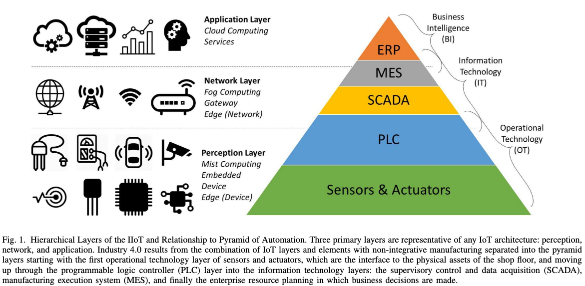
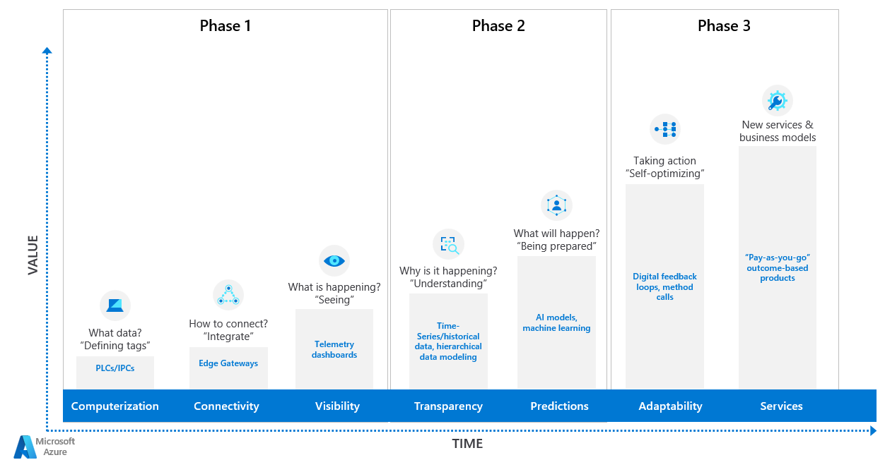
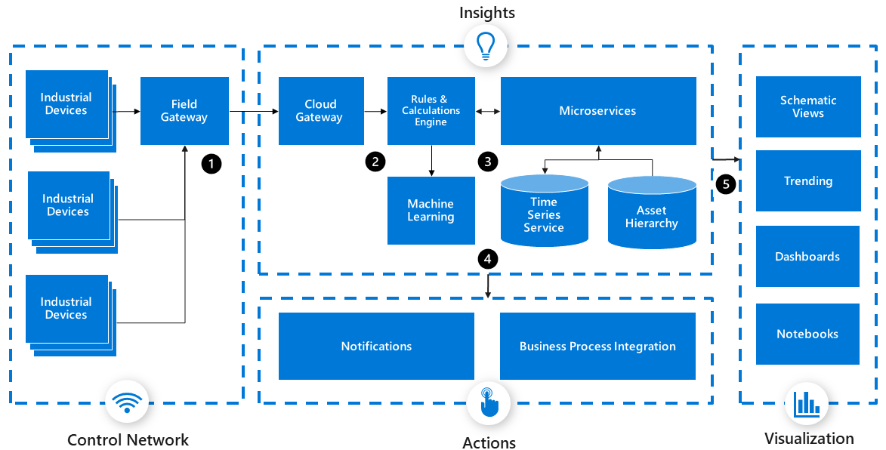
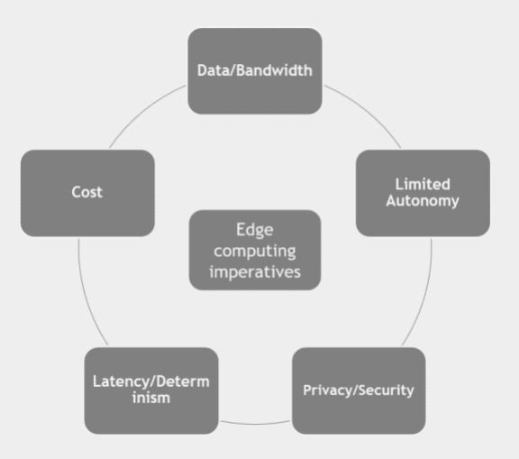

# Design patterns and modelling

- [Design patterns and modelling](#design-patterns-and-modelling)
  - [Design Patterns](#design-patterns)
    - [Design Patterns in IIoT](#design-patterns-in-iiot)
    - [Design Patterns by the Gang of Four (GoF)](#design-patterns-by-the-gang-of-four-gof)
    - [Comparison](#comparison)
  - [Design Patterns in IIoT](#design-patterns-in-iiot-1)
  - [Exploring the architecture](#exploring-the-architecture)
- [Protobuf](#protobuf)
  - [IIoT output as Protobuf](#iiot-output-as-protobuf)
    - [Sensor Data](#sensor-data)
    - [Equipment Status](#equipment-status)
    - [Production Line Information](#production-line-information)
    - [Alarm System Events](#alarm-system-events)
  - [Code generation (models \& classes) from Protobufs (language agnostic)](#code-generation-models--classes-from-protobufs-language-agnostic)
    - [Rust](#rust)
    - [C#](#c)
  - [Bibliography](#bibliography)

## Design Patterns
Design patterns for the Industrial Internet of Things (IIoT) and design patterns defined by the Gang of Four (GoF) represent two distinct groups of design concepts that target different domains and purposes.

### Design Patterns in IIoT
IIoT design patterns  are special patterns specifically tailored to the challenges of system development in the field of  Industrial Internet of Things. These patterns are focused on addressing the complexities associated with large-scale industrial environments, sensor data processing, edge computing, real-time data analysis, security, and communication protocols. These revolve around connected devices, data management, and the special requirements of industrial ecosystems.

Key areas addressed by IIoT design patterns include:
> Data Processing and Communication: Dealing with real-time data from numerous devices, sensors, and systems, and ensuring efficient communication and processing.
> Edge Computing and Device Interactions: Strategies for handling data processing at the edge, device interactions, and optimizing communication to reduce latency.
> Security and Device Management: Patterns for securing communication, managing devices, and implementing access control measures to safeguard critical infrastructure.

The paper [Design Patterns for the Industrial Internet of Things](https://par.nsf.gov/servlets/purl/10066528) has a comprehensive Pyramid of Automation:


### Design Patterns by the Gang of Four (GoF)
The GoF design patterns, introduced in the book "Design Patterns: Elements of Reusable Object-Oriented Software," comprise a set of general-purpose design patterns for object-oriented software development. These patterns are more abstract and applicable to a wide range of software development domains and languages, focusing on design problems within software systems.

The GoF patterns are classified into three categories:
> Creational Patterns: Addressing object creation mechanisms.\
> Structural Patterns: Concerned with the composition of classes or objects.\
> Behavioral Patterns: Focusing on object collaboration and responsibility.

These patterns, such as Singleton, Factory Method, Adapter, Observer, Strategy, and others, are designed to solve common software design issues, including object instantiation, composition, interaction between objects, and encapsulating behavior.

### Comparison
The key difference lies in their scope and focus:
> Scope: IIoT patterns are specific to the industrial domain, dealing with challenges unique to interconnected devices, sensor networks, edge computing, and industrial data processing. GoF patterns, on the other hand, are more general and abstract, applicable across various software domains.\
> Focus: IIoT patterns target problems related to data flow, real-time processing, security, and device interaction in the industrial setting. GoF patterns focus on object-oriented design concepts and solutions for software structure, behavior, and creation.

While they serve different purposes, there might be instances where both sets of patterns could be applied in building complex IIoT systems that involve intricate software architectures for handling industrial data and interactions among devices.

## Design Patterns in IIoT
Industrial Internet of Things (IIoT) design patterns refer to reusable solutions to common problems and challenges encountered when developing IIoT systems. These patterns help create scalable, robust, and efficient architectures for managing and processing data in industrial environments. 

Azure has an in-depth enumeration and explanation of Cloud Design Patterns here: [Cloud Design Patterns](https://learn.microsoft.com/en-us/azure/architecture/patterns/).

Some cloud design patterns are commonly employed in IIoT:
1. Pub-Sub (Publisher/Subscriber)
   - Utilized for communication between various devices, sensors, and applications. Devices publish data to specific topics, and other devices or applications subscribe to these topics to receive the data they are interested in. This pattern enables a loosely coupled architecture and facilitates scalability. This pattern involves a messaging system where sensors or devices publish data to a broker. Other devices or applications can subscribe to the broker to receive the data they need. A situation in which publisher subscriber pattern can be used is when dealing with data sent using pika library via RabbitMQ:

```csharp
using System;
using RabbitMQ.Client;
using System.Text;

class Program
{
    static void Main(string[] args)
    {
        var factory = new ConnectionFactory() { HostName = "localhost" };
        using (var connection = factory.CreateConnection())
        using (var channel = connection.CreateModel())
        {
            channel.ExchangeDeclare("my_exchange", ExchangeType.Fanout);

            while (true)
            {
                Console.Write("Enter a message to publish (or 'exit' to quit): ");
                string message = Console.ReadLine();

                if (message.ToLower() == "exit")
                    break;

                var body = Encoding.UTF8.GetBytes(message);
                channel.BasicPublish(exchange: "my_exchange",
                                     routingKey: "",
                                     basicProperties: null,
                                     body: body);
                Console.WriteLine($" [x] Sent: {message}");
            }
        }
    }
}
```
The subscriber has to use a queue that is bound at that specific exchange:
``` csharp
using System;
using RabbitMQ.Client;
using RabbitMQ.Client.Events;
using System.Text;

class Program
{
    static void Main(string[] args)
    {
        var factory = new ConnectionFactory() { HostName = "localhost" };
        using (var connection = factory.CreateConnection())
        using (var channel = connection.CreateModel())
        {
            channel.ExchangeDeclare("my_exchange", ExchangeType.Fanout);
            var queueName = channel.QueueDeclare().QueueName;
            channel.QueueBind(queue: queueName,
                              exchange: "my_exchange",
                              routingKey: "");

            Console.WriteLine(" [*] Waiting for messages. To exit, press CTRL+C");

            var consumer = new EventingBasicConsumer(channel);
            consumer.Received += (model, ea) =>
            {
                var body = ea.Body;
                var message = Encoding.UTF8.GetString(body);
                Console.WriteLine($" [x] Received: {message}");
            };

            channel.BasicConsume(queue: queueName,
                                 autoAck: true,
                                 consumer: consumer);

            Console.WriteLine(" Press [enter] to exit.");
            Console.ReadLine();
        }
    }
}
```
2. Stategy for accessing db objects for different use cases:
``` csharp
using System;
using System.Collections.Generic;
using MongoDB.Bson;
using MongoDB.Driver;

// Define projection strategy interface
interface IProjectionStrategy
{
    ProjectionDefinition<BsonDocument, BsonDocument> GetProjection();
}

// Concrete projection strategies
class BasicProjection : IProjectionStrategy
{
    public ProjectionDefinition<BsonDocument, BsonDocument> GetProjection()
    {
        return Builders<BsonDocument>.Projection.Exclude("_id").Include("name").Include("age");
    }
}

class DetailedProjection : IProjectionStrategy
{
    public ProjectionDefinition<BsonDocument, BsonDocument> GetProjection()
    {
        return Builders<BsonDocument>.Projection.Exclude("_id").Include("name").Include("age").Include("email");
    }
}

// MongoDB client and database setup
class MongoDBContext
{
    private IMongoDatabase database;

    public MongoDBContext(string connectionString, string databaseName)
    {
        var client = new MongoClient(connectionString);
        database = client.GetDatabase(databaseName);
    }

    public IMongoCollection<BsonDocument> GetCollection(string collectionName)
    {
        return database.GetCollection<BsonDocument>(collectionName);
    }
}

class Program
{
    static void Main(string[] args)
    {
        string connectionString = "mongodb://localhost:27017";
        string databaseName = "mydb";
        string collectionName = "mycollection";

        // Initialize the MongoDB context
        MongoDBContext context = new MongoDBContext(connectionString, databaseName);
        IMongoCollection<BsonDocument> collection = context.GetCollection(collectionName);

        // Choose a projection strategy based on user preferences
        IProjectionStrategy projectionStrategy = new DetailedProjection(); // Change to BasicProjection for a basic projection

        // Query MongoDB with the selected projection strategy
        var documents = collection.Find(new BsonDocument())
            .Project(projectionStrategy.GetProjection())
            .ToList();

        foreach (var document in documents)
        {
            Console.WriteLine(document.ToJson());
        }
    }
}

```
3. Edge Computing
   - In IIoT, Edge Computing involves processing data closer to the source (at the edge) rather than relying solely on centralized cloud systems. This pattern helps in reducing latency, enabling real-time processing, and reducing the amount of data that needs to be sent to the cloud, which can be critical in industrial settings with limited bandwidth or where real-time responses are necessary.
4. Device Shadowing
   - A pattern commonly used in IIoT for maintaining a virtual representation (shadow) of a physical device. This shadow maintains the current state of the device and can be used for synchronization, enabling more efficient communication, and enabling quick access to device information without directly interacting with the physical device.
5. Security Patterns
   - Security is a critical concern in IIoT. Patterns like Role-based Access Control (RBAC), encryption, secure bootstrapping, and secure communication protocols (such as TLS) are crucial for securing communications, data, and devices in an IIoT ecosystem.
6. Batching and Buffering
   - Implementing systems that can handle intermittent connectivity and varying data rates is essential. Batching and buffering patterns enable the collection of data from sensors or devices and then transmitting it in optimized batches, reducing network traffic and improving efficiency.
7. Data Normalization and Transformation
   - IIoT systems often deal with data from disparate sources, in different formats. This pattern involves standardizing and transforming data into a common format for processing and analysis, facilitating interoperability among different devices and systems.
8. Predictive Maintenance
   - By analyzing historical data and real-time sensor data, predictive maintenance patterns help in predicting when equipment might fail, allowing for maintenance before an actual breakdown, thereby reducing downtime and costs.
9. Digital Twin
   - Creating digital representations of physical assets or processes helps in simulation, monitoring, and analysis. Digital twins enable better understanding and optimization of physical systems, aiding in predictive analysis and decision-making.
10. Time Series Data Storage
   - Specialized databases or storage systems designed for handling time-series data efficiently are crucial in IIoT. These patterns enable storing, querying, and analyzing data collected over time, such as sensor readings and operational data.
11. Dynamic Scaling
    - This pattern involves the ability of the IIoT system to dynamically scale resources based on demand. It ensures that the system can handle fluctuating workloads, such as increased data volume during peak times.
12. Sensor Aggregation Pattern
    - This pattern involves aggregating data from multiple sensors to gain a broader understanding of a system or environment. It addresses the challenge of handling data from numerous sensors scattered across various locations and provides a unified view of the collected data.
``` csharp
using System;
using System.Collections.Generic;

// Define a Sensor class to represent individual sensors.
class Sensor
{
    public string Name { get; set; }
    public double Value { get; set; }

    public Sensor(string name)
    {
        Name = name;
    }

    public void ReadSensorValue()
    {
        // Simulate reading sensor data.
        Random rand = new Random();
        Value = rand.NextDouble() * 100.0;
    }
}

// Define an Aggregator class to aggregate data from multiple sensors.
class DataAggregator
{
    private List<Sensor> sensors;

    public DataAggregator()
    {
        sensors = new List<Sensor>();
    }

    public void AddSensor(Sensor sensor)
    {
        sensors.Add(sensor);
    }

    public void AggregateData()
    {
        foreach (var sensor in sensors)
        {
            sensor.ReadSensorValue();
        }
    }

    public void ReportAggregatedData()
    {
        foreach (var sensor in sensors)
        {
            Console.WriteLine($"Sensor: {sensor.Name}, Value: {sensor.Value}");
        }
    }
}

class Program
{
    static void Main()
    {
        // Create sensor objects and add them to the aggregator.
        Sensor sensor1 = new Sensor("Sensor 1");
        Sensor sensor2 = new Sensor("Sensor 2");

        DataAggregator aggregator = new DataAggregator();
        aggregator.AddSensor(sensor1);
        aggregator.AddSensor(sensor2);

        // Simulate data aggregation and reporting.
        aggregator.AggregateData();
        aggregator.ReportAggregatedData();
    }
}

```

These design patterns in IIoT aim to address various challenges encountered in industrial environments, ranging from data management, security, and communication to predictive analytics and system scalability. Combining these patterns can lead to robust, efficient, and scalable IIoT solutions.

Addressing these patterns in Azure is exemplified here: [Industrial IoT patterns](https://learn.microsoft.com/en-us/azure/architecture/guide/iiot-patterns/iiot-patterns-overview).



## Exploring the architecture
These are several IoT architecture types that we took into account:
1. Centralized Architecture
   1. The centralized architecture pattern involves a central hub or gateway that serves as the focal point for data collection and control. IoT devices communicate with the central hub, which then processes and analyzes the data. This pattern offers simplicity and ease of management, making it suitable for applications with a limited number of devices and straightforward data flows.
2. Decentralized Architecture
   1. In a decentralized architecture, intelligence is distributed across the network. IoT devices communicate directly with each other or through intermediate gateways, reducing reliance on a central hub. This pattern provides scalability, resilience, and lower latency, making it ideal for applications that require high device density, real-time responsiveness, and fault tolerance.
3. Edge Computing Architecture
   1. Edge computing architecture brings processing capabilities closer to IoT devices at the network edge. By performing data processing and analytics at or near the source, this pattern minimizes latency, reduces bandwidth usage, and enhances data privacy. Edge computing is well-suited for applications that require real-time decision-making, low-latency responses, and reduced reliance on cloud connectivity.
4. Hybrid Architecture
   1. The hybrid architecture pattern combines elements of both centralized and decentralized approaches. It leverages the benefits of centralized control for management and analytics while distributing processing and decision-making closer to the edge. This pattern strikes a balance between scalability, resilience, and real-time responsiveness, making it suitable for diverse IoT use cases with varying requirements.
5. Event-Driven Architecture
   1. Event-driven architecture focuses on capturing and processing events triggered by IoT devices. It leverages messaging systems or event-driven frameworks to handle data ingestion, event routing, and subsequent actions. This pattern enables real-time event processing, asynchronous communication, and flexible integration with various systems. Event-driven architecture is well-suited for applications that require event correlation, complex workflows, and event-driven actions.

While exploring the system's scope we reached the agreement that a combination of **Centralized** with **Event-Driven** architectures would suite our case. We also took into account [IoT Design Patterns: Computational Constructs to Design, Build and Engineer Edge Applications](https://conferences.computer.org/iotDI/prev/2016/papers/9948a277.pdf).

An generic architecture example in Azure can be is in-depth explained here: [Azure industrial IoT analytics guidance](https://learn.microsoft.com/en-us/azure/architecture/guide/iiot-guidance/iiot-architecture).



# Protobuf
Protocol buffers (Protobufs) are a popular choice for serializing structured data in Industrial Internet of Things (IIoT) systems. They provide a platform-independent and language-independent way to define the structure of  data, streamlining communication between devices and systems.

Protobufs are used in IIoT as it follows:
1. **Efficient Data Serialization**: Protobufs provide a compact and efficient binary representation of structured data. In IIoT, where there's a vast amount of data transmitted between devices and systems, this efficient serialization helps reduce the size of the payload, leading to improved transmission speed and reduced bandwidth usage.
2. **Interoperability**: Protobufs support multiple programming languages, allowing different systems and devices, regardless of their underlying technology or platform, to exchange data seamlessly. This interoperability is crucial in IIoT, where various devices from different manufacturers might need to communicate with one another.
3. **Versioning and Evolution**: IIoT systems often evolve over time, with changes in the data structure and the introduction of new fields or parameters. Protobuf supports backward and forward compatibility, allowing fields to be added or removed without breaking compatibility with older versions, making it easier to version control your IIoT systems. 
4. **Schema definition**: Protobuf uses schemas to define the structure of data. This schema acts as a contract that defines the format of the data, making it easier to validate and analyze incoming data. This is especially valuable in IIoT systems where data consistency is important. 
5. **Reduced overhead**: The binary format used by Protobufs and the ability to define a schema tailored to the specific data exchanged in IIoT systems leads to reduced overhead compared to other text-based serialization formats like JSON or XML.
6. **Support for Embedded Systems**: In IIoT, where devices might have limited resources, Protobufs' compact binary format and the ability to generate code for resource-constrained devices make it a favorable choice for communication even in edge devices.
7. **Streaming and Real-Time Processing**: Protobufs support streaming, allowing the transmission of data in smaller chunks, making it suitable for real-time data processing, a critical requirement in many IIoT applications.

Protobufs offer various advantages but they also come with some considerations. These include the necessity of additional tooling for code generation, an initial learning curve for defining the schema, and the need for well-defined communication protocols for effectively exchanging data.

The use of Protocol Buffers in IIoT contributes significantly to efficient data exchange, interoperability, and streamlined communication between various devices and systems within the industrial landscape.

## IIoT output as Protobuf

We exemplified here several Protobuf IIoT outputs that we can use.

### Sensor Data
```
syntax = "proto3";

message TemperatureData {
  int32 sensor_id = 1;
  float temperature_celsius = 2;
  int64 timestamp = 3;
  // Additional sensor data fields can be added here
}
```

### Equipment Status
```
syntax = "proto3";

enum EquipmentStatus {
  OK = 0;
  WARNING = 1;
  ERROR = 2;
}

message Equipment {
  int32 equipment_id = 1;
  EquipmentStatus status = 2;
  string message = 3;
  // Additional equipment status fields can be added here
}
```

### Production Line Information
```
syntax = "proto3";

message Product {
  int32 product_id = 1;
  string product_name = 2;
  float weight = 3;
  int32 quantity = 4;
  // Additional product information fields can be added here
}

message ProductionLineInfo {
  int32 line_id = 1;
  repeated Product products = 2;
  // Additional production line information fields can be added here
}
```

### Alarm System Events
```
syntax = "proto3";

message AlarmEvent {
  int32 alarm_id = 1;
  string alarm_description = 2;
  int64 timestamp = 3;
  // Additional alarm event fields can be added here
}
```

## Code generation (models & classes) from Protobufs (language agnostic)
We are able to create models and classes from .proto files in a variety of languages. We picked Rust and C# as examples.

### Rust
We first create a new project **rust_model_generation** via command **cargo new rust_model_generation** followed by its dependencies added in `Cargo.toml` file:
```
[package]
name = "rust_model_generation"
version = "0.1.0"
edition = "2021"

# See more keys and their definitions at https://doc.rust-lang.org/cargo/reference/manifest.html

[dependencies]
prost = "0.12.1"
prost-build = "0.12.1"
```
Then we add in `main.rs` file the following:
```rs
fn main() {
    prost_build::compile_protos(&[ // array of files
            "alarm_system_event.proto", 
            "equipment_status.proto", 
            "product_line_information.proto", 
            "sensor_data.proto"], 
            &["../protobuf_models"]) // the folder
        .unwrap();
}
```
We run `RUST_BACKTRACE=full OUT_DIR="." cargo run` command and we get all the models ready to be used in a file called `_.rs`:
```rs
#[allow(clippy::derive_partial_eq_without_eq)]
#[derive(Clone, PartialEq, ::prost::Message)]
pub struct AlarmEvent {
    #[prost(int32, tag = "1")]
    pub alarm_id: i32,
    #[prost(string, tag = "2")]
    pub alarm_description: ::prost::alloc::string::String,
    /// Additional alarm event fields can be added here
    #[prost(int64, tag = "3")]
    pub timestamp: i64,
}
#[allow(clippy::derive_partial_eq_without_eq)]
#[derive(Clone, PartialEq, ::prost::Message)]
pub struct Equipment {
    #[prost(int32, tag = "1")]
    pub equipment_id: i32,
    #[prost(enumeration = "EquipmentStatus", tag = "2")]
    pub status: i32,
    /// Additional equipment status fields can be added here
    #[prost(string, tag = "3")]
    pub message: ::prost::alloc::string::String,
}
#[derive(Clone, Copy, Debug, PartialEq, Eq, Hash, PartialOrd, Ord, ::prost::Enumeration)]
#[repr(i32)]
pub enum EquipmentStatus {
    Ok = 0,
    Warning = 1,
    Error = 2,
}
impl EquipmentStatus {
    /// String value of the enum field names used in the ProtoBuf definition.
    ///
    /// The values are not transformed in any way and thus are considered stable
    /// (if the ProtoBuf definition does not change) and safe for programmatic use.
    pub fn as_str_name(&self) -> &'static str {
        match self {
            EquipmentStatus::Ok => "OK",
            EquipmentStatus::Warning => "WARNING",
            EquipmentStatus::Error => "ERROR",
        }
    }
    /// Creates an enum from field names used in the ProtoBuf definition.
    pub fn from_str_name(value: &str) -> ::core::option::Option<Self> {
        match value {
            "OK" => Some(Self::Ok),
            "WARNING" => Some(Self::Warning),
            "ERROR" => Some(Self::Error),
            _ => None,
        }
    }
}
#[allow(clippy::derive_partial_eq_without_eq)]
#[derive(Clone, PartialEq, ::prost::Message)]
pub struct Product {
    #[prost(int32, tag = "1")]
    pub product_id: i32,
    #[prost(string, tag = "2")]
    pub product_name: ::prost::alloc::string::String,
    #[prost(float, tag = "3")]
    pub weight: f32,
    /// Additional product information fields can be added here
    #[prost(int32, tag = "4")]
    pub quantity: i32,
}
#[allow(clippy::derive_partial_eq_without_eq)]
#[derive(Clone, PartialEq, ::prost::Message)]
pub struct ProductionLineInfo {
    #[prost(int32, tag = "1")]
    pub line_id: i32,
    /// Additional production line information fields can be added here
    #[prost(message, repeated, tag = "2")]
    pub products: ::prost::alloc::vec::Vec<Product>,
}
#[allow(clippy::derive_partial_eq_without_eq)]
#[derive(Clone, PartialEq, ::prost::Message)]
pub struct TemperatureData {
    #[prost(int32, tag = "1")]
    pub sensor_id: i32,
    #[prost(float, tag = "2")]
    pub temperature_celsius: f32,
    /// Additional sensor data fields can be added here
    #[prost(int64, tag = "3")]
    pub timestamp: i64,
}
```
These kind of approach can easily generate an authentication system in a matter of minutes as exemplified here: [Roll your own auth with Rust and Protobuf](https://dev.to/martinp/roll-your-own-auth-with-rust-and-protobuf-24ke) and you can use various patterns with your models as exposed here: [Bridging the Gap: Understanding Adapter and Composite Patterns in Rust](https://dev.to/zhukmax/bridging-the-gap-understanding-adapter-and-composite-patterns-in-rust-50ab) keeping in mind the Edge computing imperatives mentioned in [Industrial IoT Architecture Patterns - AWS Whitepaper](https://docs.aws.amazon.com/pdfs/whitepapers/latest/industrial-iot-architecture-patterns/industrial-iot-architecture-patterns.pdf#industrial-iot-architecture-patterns):


### C#
It turns out that you can also plug the generated DAO into an ORM, whose example of Entity Framework Core 3.0 I will outline below and effectively derive data-base schema out of it too.

We create a new project name `c_sharp_model_generation` using the command `dotnet new console -o c_sharp_model_generation` and then we add the following dependencies:
```csharp
dotnet add package Microsoft.EntityFrameworkCore.Design
dotnet add package Microsoft.EntityFrameworkCore.Sqlite
dotnet add package Grpc.Tools
dotnet add package Google.Protobuf
```

You then create a `Database.cs` file as it follows:
```csharp

using Google.Protobuf;
using Microsoft.EntityFrameworkCore;

class Database : DbContext {
    protected override void OnConfiguring(DbContextOptionsBuilder optionsBuilder) {
        optionsBuilder.UseSqlite("Data Source=example.db");
    }

  public DbSet<AlarmEvent> AlarmEvents { get; set; }
  public DbSet<Equipment> Equipments { get; set; }
  public DbSet<ProductionLineInfo> ProductionLineInfos { get; set; }
  public DbSet<TemperatureData> TemperatureDatas { get; set; }
}
```

And run command `dotnet ef migrations add initial` that will generate in a `Migrations` folder 3 files, one of them being `DatabaseModelSnapshot.cs`:
```csharp
// <auto-generated />
using System;
using Microsoft.EntityFrameworkCore;
using Microsoft.EntityFrameworkCore.Infrastructure;
using Microsoft.EntityFrameworkCore.Storage.ValueConversion;

#nullable disable

namespace c_sharp_model_generation.Migrations
{
    [DbContext(typeof(Database))]
    partial class DatabaseModelSnapshot : ModelSnapshot
    {
        protected override void BuildModel(ModelBuilder modelBuilder)
        {
#pragma warning disable 612, 618
            modelBuilder.HasAnnotation("ProductVersion", "7.0.13");

            modelBuilder.Entity("AlarmEvent", b =>
                {
                    b.Property<long>("Id")
                        .ValueGeneratedOnAdd()
                        .HasColumnType("INTEGER");

                    b.Property<string>("AlarmDescription")
                        .HasColumnType("TEXT");

                    b.Property<int>("AlarmId")
                        .HasColumnType("INTEGER");

                    b.Property<long>("Timestamp")
                        .HasColumnType("INTEGER");

                    b.HasKey("Id");

                    b.ToTable("AlarmEvents");
                });

            modelBuilder.Entity("Equipment", b =>
                {
                    b.Property<long>("Id")
                        .ValueGeneratedOnAdd()
                        .HasColumnType("INTEGER");

                    b.Property<int>("EquipmentId")
                        .HasColumnType("INTEGER");

                    b.Property<string>("Message")
                        .HasColumnType("TEXT");

                    b.Property<int>("Status")
                        .HasColumnType("INTEGER");

                    b.HasKey("Id");

                    b.ToTable("Equipments");
                });

            modelBuilder.Entity("Product", b =>
                {
                    b.Property<long>("Id")
                        .ValueGeneratedOnAdd()
                        .HasColumnType("INTEGER");

                    b.Property<string>("Name")
                        .HasColumnType("TEXT");

                    b.Property<long?>("ProductionLineInfoId")
                        .HasColumnType("INTEGER");

                    b.Property<int>("Quantity")
                        .HasColumnType("INTEGER");

                    b.Property<float>("Weight")
                        .HasColumnType("REAL");

                    b.HasKey("Id");

                    b.HasIndex("ProductionLineInfoId");

                    b.ToTable("Product");
                });

            modelBuilder.Entity("ProductionLineInfo", b =>
                {
                    b.Property<long>("Id")
                        .ValueGeneratedOnAdd()
                        .HasColumnType("INTEGER");

                    b.HasKey("Id");

                    b.ToTable("ProductionLineInfos");
                });

            modelBuilder.Entity("TemperatureData", b =>
                {
                    b.Property<long>("Id")
                        .ValueGeneratedOnAdd()
                        .HasColumnType("INTEGER");

                    b.Property<int>("SensorId")
                        .HasColumnType("INTEGER");

                    b.Property<float>("TemperatureCelsius")
                        .HasColumnType("REAL");

                    b.Property<long>("Timestamp")
                        .HasColumnType("INTEGER");

                    b.HasKey("Id");

                    b.ToTable("TemperatureDatas");
                });

            modelBuilder.Entity("Product", b =>
                {
                    b.HasOne("ProductionLineInfo", null)
                        .WithMany("Products")
                        .HasForeignKey("ProductionLineInfoId");
                });

            modelBuilder.Entity("ProductionLineInfo", b =>
                {
                    b.Navigation("Products");
                });
#pragma warning restore 612, 618
        }
    }
}
```

Useful articles can be found either on Microsoft offical site: [Getting Started with EF Core](https://learn.microsoft.com/ro-ro/ef/core/get-started/overview/first-app?tabs=netcore-cli) or here: [Using Google Protocol Buffers as data definition language for Entity Framework Core storage](https://medium.com/@kamil.skalski/using-google-protocol-buffers-as-data-definition-language-for-entity-framework-core-storage-a130e5bfc71f).

## Bibliography
[Bridging the Gap: Understanding Adapter and Composite Patterns in Rust](https://dev.to/zhukmax/bridging-the-gap-understanding-adapter-and-composite-patterns-in-rust-50ab)\
[Roll your own auth with Rust and Protobuf](https://dev.to/martinp/roll-your-own-auth-with-rust-and-protobuf-24ke)\
[Industrial IoT Architecture Patterns](https://docs.aws.amazon.com/pdfs/whitepapers/latest/industrial-iot-architecture-patterns/industrial-iot-architecture-patterns.pdf#industrial-iot-architecture-patterns)\
[Pattern language for IoT applications](https://hillside.net/plop/2016/papers/writinggroup/17.2.pdf)\
[An Overview of Design Patterns for Self-Adaptive Systems in the Context of the Internet of Things](https://d-nb.info/1232177768/34)
[Internet of Things Patterns](https://www.iaas.uni-stuttgart.de/publications/INPROC-2016-46-Internet-of-Things-Patterns.pdf)\
[Internet of Things design patterns modeling proven correct by construction: Application to aged care solution](https://www.sciencedirect.com/science/article/abs/pii/S0167739X23002017)\
[Design Patterns for the Industrial Internet of Things](https://par.nsf.gov/servlets/purl/10066528)\
[Industrial IoT patterns](https://learn.microsoft.com/en-us/azure/architecture/guide/iiot-patterns/iiot-patterns-overview)\
[Machinetalk explained Part 5: Code Generation](https://machinekoder.com/machinetalk-explained-part-5-code-generation)\
[Streamline microservices development with a protobuf-based code generator](https://www.linkedin.com/pulse/streamline-microservices-development-protobuf-based-code-ansel-castro)\
[Using Google Protocol Buffers as data definition language for Entity Framework Core storage](https://medium.com/@kamil.skalski/using-google-protocol-buffers-as-data-definition-language-for-entity-framework-core-storage-a130e5bfc71f)\
[IoT Patterns — Managed IoT Data Services](https://medium.com/@costastselios/iot-patterns-managed-iot-data-services-350c17df2d8b)\
[Exploring IoT Architecture Patterns: Building the Future of Connectivity!](https://www.linkedin.com/pulse/exploring-iot-architecture-patterns-building-future-himanshu-shah)\
[IoT Design Patterns: Computational Constructs to Design, Build and Engineer Edge Applications](https://nmsl.cs.nthu.edu.tw/wp-content/uploads/2011/10/images_groupmeeting_1116-PH.pdf)\
[Modeling IoT Design Patterns Proven Correct by Construction](https://link.springer.com/chapter/10.1007/978-3-031-09593-1_3)\
[Design Patterns for the Internet of Things](https://community.arm.com/arm-community-blogs/b/internet-of-things-blog/posts/design-patterns-for-an-internet-of-things)\
[10 Trending Design Patterns in IoT Solutions and Architectures](https://www.linkedin.com/pulse/10-trending-design-patterns-iot-solutions-vishal-bhardwaj)
