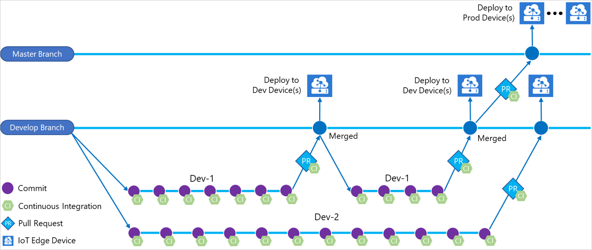
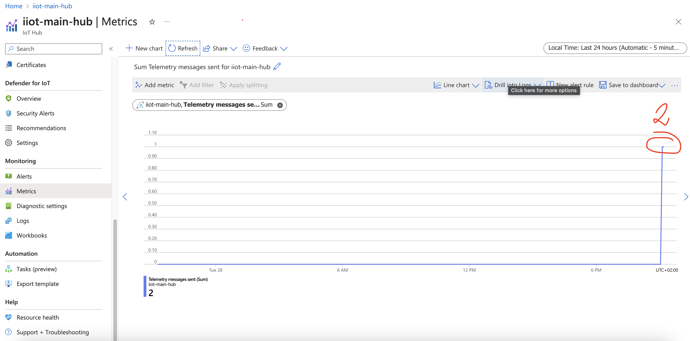

- [Stages](#stages)
  - [Install tools](#install-tools)
  - [Create Solution \& Project](#create-solution--project)
  - [Get the actual template for the function](#get-the-actual-template-for-the-function)
  - [Build a viable CI/CD integration](#build-a-viable-cicd-integration)
  - [Connect to the IoT Hub](#connect-to-the-iot-hub)
  - [Handle Protobuf serialization](#handle-protobuf-serialization)
  - [Run the Azure Function locally](#run-the-azure-function-locally)
  - [Next Steps](#next-steps)
- [Bibliography](#bibliography)

# Stages
## Install tools

```
The following steps use Homebrew to install the Core Tools on macOS.

Install Homebrew, if it's not already installed.

Install the Core Tools package:
brew tap azure/functions
brew install azure-functions-core-tools@4
# if upgrading on a machine that has 2.x or 3.x installed:
brew link --overwrite azure-functions-core-tools@4
```

## Create Solution & Project

```
Create solution:

dotnet new sln -o iot_device_01 

Create Azure Function Project:

func init FunctionDeviceSimulator --worker-runtime dotnet-isolated --target-framework net6.0  
```

## Get the actual template for the function

First check what templates you have available:
```
func templates list

C# Templates:
  Azure Blob Storage trigger
  Azure Cosmos DB trigger
  Durable Functions activity
  Durable Functions entity (class)
  Durable Functions entity (function)
  Durable Functions Entity HTTP starter
  Durable Functions HTTP starter
  Durable Functions orchestrator
  Azure Event Grid trigger
  Azure Event Hub trigger
  HTTP trigger
  IoT Hub (Event Hub)
  Kafka output
  Kafka trigger
  Azure Queue Storage trigger
  RabbitMQ trigger
  SendGrid
  Azure Service Bus Queue trigger
  Azure Service Bus Topic trigger
  SignalR negotiate HTTP trigger
  SQL Input Binding
  SQL Output Binding
  Timer trigger

Custom Templates:
  Azure Blob Storage trigger
  Azure Event Grid trigger
  Azure Event Hub trigger
  HTTP trigger
  IoT Hub (Event Hub)
  Kafka trigger
  Azure Queue Storage trigger
  RabbitMQ trigger
  SendGrid
  Azure Service Bus Queue trigger
  Azure Service Bus Topic trigger
  SignalR negotiate HTTP trigger
  Timer trigger

JavaScript Templates:
  Azure Blob Storage trigger
  Azure Cosmos DB trigger
  Durable Functions activity
  Durable Functions entity
  Durable Functions Entity HTTP starter
  Durable Functions HTTP starter
  Durable Functions orchestrator
  Azure Event Grid trigger
  Azure Event Hub trigger
  HTTP trigger
  IoT Hub (Event Hub)
  Kafka output
  Kafka trigger
  Azure Queue Storage trigger
  RabbitMQ trigger
  SendGrid
  Azure Service Bus Queue trigger
  Azure Service Bus Topic trigger
  SignalR negotiate HTTP trigger
  SQL Input Binding
  SQL Output Binding
  Timer trigger
  Azure Blob Storage trigger
  Azure Cosmos DB trigger
  Durable Functions entity
  Durable Functions orchestrator
  Azure Event Grid trigger
  Azure Event Hub trigger
  HTTP trigger
  Azure Queue Storage trigger
  Azure Service Bus Queue trigger
  Azure Service Bus Topic trigger
  Timer trigger
  Dapr Publish Output Binding
  Dapr Service Invocation Trigger
  Dapr Topic Trigger

PowerShell Templates:
  Azure Blob Storage trigger
  Azure Cosmos DB trigger
  Durable Functions activity
  Durable Functions HTTP starter
  Durable Functions orchestrator
  Azure Event Grid trigger
  Azure Event Hub trigger
  HTTP trigger
  IoT Hub (Event Hub)
  Kafka output
  Kafka trigger
  Azure Queue Storage trigger
  RabbitMQ trigger
  SendGrid
  Azure Service Bus Queue trigger
  Azure Service Bus Topic trigger
  SignalR negotiate HTTP trigger
  SQL Input Binding
  SQL Output Binding
  Timer trigger

Python Templates:
  Azure Blob Storage trigger
  Azure Cosmos DB trigger
  Durable Functions activity
  Durable Functions entity
  Durable Functions HTTP starter
  Durable Functions orchestrator
  Azure Event Grid trigger
  Azure Event Hub trigger
  HTTP trigger
  Kafka output
  Kafka trigger
  Azure Queue Storage trigger
  RabbitMQ trigger
  Azure Service Bus Queue trigger
  Azure Service Bus Topic trigger
  SQL Input Binding
  SQL Output Binding
  Timer trigger

TypeScript Templates:
  Azure Blob Storage trigger
  Durable Functions activity
  Durable Functions entity
  Durable Functions Entity HTTP starter
  Durable Functions HTTP starter
  Durable Functions orchestrator
  Azure Event Grid trigger
  Azure Event Hub trigger
  HTTP trigger
  IoT Hub (Event Hub)
  Kafka output
  Kafka trigger
  Azure Queue Storage trigger
  RabbitMQ trigger
  SendGrid
  Azure Service Bus Queue trigger
  Azure Service Bus Topic trigger
  SignalR negotiate HTTP trigger
  SQL Input Binding
  Timer trigger
  Azure Blob Storage trigger
  Azure Cosmos DB trigger
  Durable Functions entity
  Durable Functions orchestrator
  Azure Event Grid trigger
  Azure Event Hub trigger
  HTTP trigger
  Azure Queue Storage trigger
  Azure Service Bus Queue trigger
  Azure Service Bus Topic trigger
  Timer trigger
```

Pick the one you need: 
```
func new --name GenerateDeviceResponse --template "Timer trigger" --force
```

Missing .NET dependencies:
```
[2023-11-28T15:45:15.804Z] You must install or update .NET to run this application.
[2023-11-28T15:45:15.805Z] App: /Users/gheorghitamutu/Repositories/FactoryWatcher/iot_device_01/bin/output/iot_device_01.dll
[2023-11-28T15:45:15.805Z] Language Worker Process exited. Pid=44189.
[2023-11-28T15:45:15.805Z] dotnet exited with code 150 (0x96). https://aka.ms/dotnet/app-launch-failed.
[2023-11-28T15:45:15.805Z] Architecture: arm64
[2023-11-28T15:45:15.805Z] Framework: 'Microsoft.NETCore.App', version '6.0.0' (arm64)
[2023-11-28T15:45:15.805Z] .NET location: /opt/homebrew/Cellar/dotnet/7.0.100/libexec/
[2023-11-28T15:45:15.805Z] The following frameworks were found:
[2023-11-28T15:45:15.805Z]   7.0.0 at [/opt/homebrew/Cellar/dotnet/7.0.100/libexec/shared/Microsoft.NETCore.App]
[2023-11-28T15:45:15.805Z] Learn about framework resolution:
[2023-11-28T15:45:15.805Z] https://aka.ms/dotnet/app-launch-failed
[2023-11-28T15:45:15.805Z] To install missing framework, download:
[2023-11-28T15:45:15.805Z] https://aka.ms/dotnet-core-applaunch?framework=Microsoft.NETCore.App&framework_version=6.0.0&arch=arm64&rid=osx.14-arm64
```

Run the function locally:
```
func start
```

## Build a viable CI/CD integration

Via https://learn.microsoft.com/en-us/azure/iot-edge/how-to-continuous-integration-continuous-deployment-classic?view=iotedge-1.4&viewFallbackFrom=iotedge-2020-11 we looked at:


We actually chosen a GitHub workflow whom steps are explained in https://learn.microsoft.com/en-us/azure/app-service/deploy-github-actions?tabs=applevel.

```
# Docs for the Azure Web Apps Deploy action: https://github.com/azure/functions-action
# More GitHub Actions for Azure: https://github.com/Azure/actions

name: Build and deploy dotnet core app to Azure Function App - IIoTDataGenerator

on:
  push:
    branches:
      - main
  workflow_dispatch:

env:
  AZURE_FUNCTIONAPP_PACKAGE_PATH: './iot_device_01' # set this to the path to your web app project, defaults to the repository root
  DOTNET_VERSION: '8.0.x' # set this to the dotnet version to use

jobs:
  build-and-deploy:
    runs-on: windows-latest
    steps:
      - name: 'Checkout GitHub Action'
        uses: actions/checkout@v2

      - name: Setup DotNet ${{ env.DOTNET_VERSION }} Environment
        uses: actions/setup-dotnet@v1
        with:
          dotnet-version: ${{ env.DOTNET_VERSION }}

      - name: 'Resolve Project Dependencies Using Dotnet'
        shell: pwsh
        run: |
          pushd './${{ env.AZURE_FUNCTIONAPP_PACKAGE_PATH }}'
          dotnet build --configuration Release --output ./output
          popd

      - name: 'Run Azure Functions Action'
        uses: Azure/functions-action@v1
        id: fa
        with:
          app-name: 'IIoTDataGenerator'
          slot-name: 'Production'
          package: '${{ env.AZURE_FUNCTIONAPP_PACKAGE_PATH }}/output'
          publish-profile: ${{ secrets.AZUREAPPSERVICE_PUBLISHPROFILE_<CENSORED> }}
```

## Connect to the IoT Hub
The connection to the IoT Hub is made via a connection string create in the resource `Shared access policies` area.
The string is usually passed via ENV VARS but for simplicity we'll hardcode it in our code.

## Handle Protobuf serialization

Install protoc
```
brew install protobuf
```

Use a simple proto model for the sensor:
```
syntax = "proto3";

enum EquipmentStatus {
  OK = 0;
  WARNING = 1;
  ERROR = 2;
}

message Equipment {
  int64 id = 1;
  int32 equipment_id = 2;
  EquipmentStatus status = 3;
  string message = 4;
  // Additional equipment status fields can be added here
}
```

Create C# class from protoc file:
```
protoc --csharp_out=. equipment_status.proto
```

## Run the Azure Function locally

Trying to run the Azure Function locally will require the solution presented in https://github.com/Azure/azure-functions-core-tools/issues/2959#issuecomment-1136356003. We need a local storage emulator (Azurite).

We need to create a new device in IoT Hub in order to specify it into the connection string!

Create a device

Device iiot-device-01 successfully created.

Success!!!
```
[2023-11-28T19:02:58.099Z] The next 5 occurrences of the 'GenerateDeviceResponse' schedule (Cron: '0 0,5,10,15,20,25,30,35,40,45,50,55 * * * *') will be:
[2023-11-28T19:02:58.099Z] 11/28/2023 21:05:00+02:00 (11/28/2023 19:05:00Z)
[2023-11-28T19:02:58.099Z] 11/28/2023 21:10:00+02:00 (11/28/2023 19:10:00Z)
[2023-11-28T19:02:58.099Z] 11/28/2023 21:15:00+02:00 (11/28/2023 19:15:00Z)
[2023-11-28T19:02:58.099Z] 11/28/2023 21:20:00+02:00 (11/28/2023 19:20:00Z)
[2023-11-28T19:02:58.099Z] 11/28/2023 21:25:00+02:00 (11/28/2023 19:25:00Z)
[2023-11-28T19:02:58.099Z] 
[2023-11-28T19:02:58.103Z] Host started (188ms)
[2023-11-28T19:02:58.103Z] Job host started
[2023-11-28T19:02:58.149Z] {
[2023-11-28T19:02:58.150Z]   "ProcessId": 52090,
[2023-11-28T19:02:58.150Z]   "RuntimeIdentifier": "osx-arm64",
[2023-11-28T19:02:58.150Z]   "WorkerVersion": "1.15.0.0",
[2023-11-28T19:02:58.150Z]   "ProductVersion": "1.15.0\u002Be358ca5b804dc282e1c98b48ab6097caca0fc0fb",
[2023-11-28T19:02:58.150Z]   "FrameworkDescription": ".NET 8.0.0",
[2023-11-28T19:02:58.150Z]   "OSDescription": "Darwin 23.0.0 Darwin Kernel Version 23.0.0: Fri Sep 15 14:43:05 PDT 2023; root:xnu-10002.1.13~1/RELEASE_ARM64_T6020",
[2023-11-28T19:02:58.150Z]   "OSArchitecture": "Arm64",
[2023-11-28T19:02:58.150Z]   "CommandLine": "/Users/gheorghitamutu/Repositories/FactoryWatcher/iot_device_01/bin/output/iot_device_01.dll --host 127.0.0.1 --port 61476 --workerId 6d31dab1-1a17-47aa-9603-485e1fc8bdc1 --requestId 4340aba2-d0be-42d7-90af-f5e64617c90d --grpcMaxMessageLength 2147483647 --functions-uri http://127.0.0.1:61476/ --functions-worker-id 6d31dab1-1a17-47aa-9603-485e1fc8bdc1 --functions-request-id 4340aba2-d0be-42d7-90af-f5e64617c90d --functions-grpc-max-message-length 2147483647"
[2023-11-28T19:02:58.150Z] }
[2023-11-28T19:02:58.223Z] Worker process started and initialized.
[2023-11-28T19:03:02.928Z] Host lock lease acquired by instance ID '000000000000000000000000320A7259'.
[2023-11-28T19:05:00.126Z] C# Timer trigger function executed at: 11/28/2023 9:05:00 PM
[2023-11-28T19:06:01.641Z] 11/28/2023 9:06:01 PM > Sending message: { "id": "1", "equipmentId": 1, "message": "Test message", "timestamp": "2023-11-28T19:05:00.156805Z" }
[2023-11-28T19:06:02.693Z] Executed 'Functions.GenerateDeviceResponse' (Succeeded, Id=0f09dfab-bc3a-4430-bce7-bac56bebff4f, Duration=62661ms)
[2023-11-28T19:09:59.998Z] Executing 'Functions.GenerateDeviceResponse' (Reason='Timer fired at 2023-11-28T21:09:59.9967860+02:00', Id=6a3ddffd-b854-4ce2-8b8e-791a91f61bce)
[2023-11-28T19:10:00.008Z] C# Timer trigger function executed at: 11/28/2023 9:10:00 PM
[2023-11-28T19:11:01.361Z] 11/28/2023 9:11:01 PM > Sending message: { "id": "1", "equipmentId": 1, "message": "Test message", "timestamp": "2023-11-28T19:10:00.008549Z" }
```

We received the messages in IoT Hub:


## Next Steps

Logic App

Use events as a trigger for executing a Logic App, starting Azure-wide workflows and automation.

Azure Function

Use events as a trigger for executing an Azure Function, which enables serverless custom code execution.

We'll be using both to automatize the pipelines and various AOP use cases.

# Bibliography
https://learn.microsoft.com/ro-ro/azure/iot-hub/quickstart-send-telemetry-cli \
https://stackoverflow.com/questions/36343223/create-c-sharp-sln-file-with-visual-studio-code \
https://learn.microsoft.com/en-us/azure/azure-functions/functions-core-tools-reference?tabs=v2#func-templates-list \
https://learn.microsoft.com/en-us/azure/azure-functions/create-first-function-cli-csharp?tabs=macos%2Cazure-cli \
https://github.com/Azure/iotedgedev \
https://learn.microsoft.com/en-us/azure/iot-edge/tutorial-develop-for-linux?view=iotedge-1.4&branch=pr-en-us-203829&tabs=csharp&pivots=iotedge-dev-cli \
https://learn.microsoft.com/en-us/azure/iot-edge/how-to-continuous-integration-continuous-deployment-classic?view=iotedge-1.4&viewFallbackFrom=iotedge-2020-11 \
https://learn.microsoft.com/en-us/azure/app-service/deploy-github-actions?tabs=applevel \
https://github.com/Azure/actions \
https://stackoverflow.com/questions/3574716/date-and-time-type-for-use-with-protobuf \
https://learn.microsoft.com/en-us/azure/azure-functions/functions-develop-vs-code?tabs=node-v3%2Cpython-v2%2Cisolated-process&pivots=programming-language-csharp \
https://github.com/Azure/azure-functions-core-tools/issues/2959#issuecomment-1136356003
