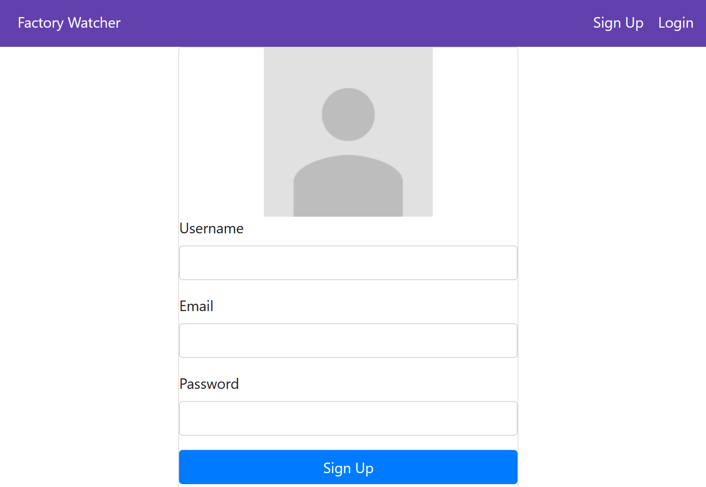

# Requirements

1. Install Visual Studio 2022 for Windows with the .NET desktop development workload
2. Npm
3. Azure Cosmos DB Emulator

# Usage of project

## Database

https://learn.microsoft.com/en-us/azure/cosmos-db/how-to-develop-emulator?tabs=docker-linux%2Ccsharp&pivots=api-nosql#install-the-emulator

1. Open Azure Cosmos DB Emulator (interface should be available at https://localhost:8081/\_explorer/index.html)
2. Go to Explorer -> New Container. Create a database with name SensorData and 2 collections: one called SensorData and one called Users.

## API

Make sure to be in the correct directory:

```bash
cd .\project\FactoryWatcherAPI\FactoryWatcherAPI
```

Fill in .\appsettings.json the data from CosmosDbSettings field according to the example from database interface in the Quickstart section:

```json
"CosmosDbSettings": {
  "EndpointUri": "https://localhost:8081",
  "PrimaryKey": "your_pk",
  "DatabaseId": "SensorData"
}
```

Then run the following commands

```
dotnet dev-certs https --trust
dotnet run --urls=http://localhost:5000
```

Now you can interact with the api using the swagger at http://localhost:5000/swagger/index.html

## Frontend

```bash
cd .\project\FactoryWatcherWeb\FactoryWatcherWeb
npm install
npm start
```

The result of the command should specify the url where the interface can be accessed

## Frontend Description and Flow

### Default page when the user is not logged-in


### Login page


### Sign up page



### Home page when the user is logged-in


## Sensor data page [with filter]


### Dashboard


